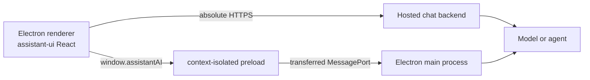

assistant-ui 可通过 `@assistant-ui/react` 在 Electron 中运行。渲染器是 React DOM 环境，因此无需安装单独的 `@assistant-ui/electron` 包。Electron 特有的决策在于模型请求在哪里运行，以及渲染器如何访问这些请求。

<Callout type="warn">
  切勿将提供商 API 密钥放入渲染器代码、`VITE_*` 变量或 preload 脚本中。打包后的值任何拥有该应用的人都可以读取。请将远程凭据保存在后端，或将本地凭据保存在主进程中，并通过操作系统支持的机密存储进行配置。
</Callout>

## 选择连接模式

| 模式 | 适用场景 | 运行时 |
| --- | --- | --- |
| 托管后端 | 你已经拥有 AI SDK 端点，需要服务器身份验证或持久化，或者要将应用发布给其他人 | 使用绝对 HTTPS URL 的 `useChatRuntime` |
| 本地主进程 | 桌面应用拥有提供商或代理进程，并且必须在没有 Web 后端的情况下运行 | 使用精简 preload/IPC 桥的 `useLocalRuntime` |



不要通过 IPC 传递 SDK 客户端、assistant-ui 运行时、回调、`AbortSignal` 或 `File`。Electron IPC 使用结构化克隆语义，因此应定义一个小型的纯数据协议。

## 模式 1：托管后端

这是最简单的集成方式。保留现有的 AI SDK 聊天路由，并将 `AssistantChatTransport` 指向其公开 URL。

```tsx title="renderer/assistant-runtime.tsx"
import type { ReactNode } from "react";
import { AssistantRuntimeProvider } from "@assistant-ui/react";
import {
  AssistantChatTransport,
  useChatRuntime,
} from "@assistant-ui/ai-sdk";

const transport = new AssistantChatTransport({
  api: "https://api.example.com/chat",
});

export function ElectronRuntimeProvider({ children }: { children: ReactNode }) {
  const runtime = useChatRuntime({ transport });

  return (
    <AssistantRuntimeProvider runtime={runtime}>
      {children}
    </AssistantRuntimeProvider>
  );
}
```

在打包的应用中，URL 必须是绝对 URL。类似 `/api/chat` 的相对值会指向渲染器的 `file://` 或自定义协议 origin，而不是已部署的后端。请针对打包后的 origin 配置后端的 CORS 策略，在 `connect-src` 中允许该端点，并像对待任何桌面客户端一样对请求进行身份验证。

该端点必须返回由 `AssistantChatTransport` 消费的 AI SDK UI 消息流。有关后端路由和工具调用设置，请参阅 [AI SDK 运行时指南](/docs/runtimes/ai-sdk/v7)。

## 模式 2：本地主进程

当 Electron 主进程调用模型或运行本地代理时，请使用此模式。将 `contextIsolation: true`、`sandbox: true` 和 `nodeIntegration: false` 保留在 `BrowserWindow` 上。在创建受信任窗口后注册 `registerAssistantIpc(mainWindow)`。

下面的示例特意仅处理文本。它通过专用的 `MessagePort` 流式传输一个请求；关闭该端口会将 assistant-ui 的 Stop 操作传递给主进程中的 `AbortController`。

### 1. 定义纯数据协议

将共享类型放在三个 Electron bundle 都可以导入的位置。

```ts title="shared/assistant-ipc.ts"
export const ASSISTANT_STREAM_CHANNEL = "assistant:stream";

export type ChatMessage =
  | { role: "user"; content: string }
  | { role: "assistant"; content: string };

export type ChatRequest = {
  system?: string;
  messages: ChatMessage[];
};

export type ChatEvent =
  | { type: "delta"; text: string }
  | { type: "done" }
  | { type: "error"; message: string };

export type AssistantAI = {
  streamChat(
    request: ChatRequest,
    onEvent: (event: ChatEvent) => void,
  ): () => void;
};
```

### 2. 暴露一个 preload 能力

只暴露渲染器所需的最小 API，而不是直接暴露 `ipcRenderer`。回调只接收经过验证的事件数据，不会接收 Electron 具有特权的 IPC 事件对象。

```ts title="preload/assistant.ts"
import { contextBridge, ipcRenderer } from "electron";
import {
  ASSISTANT_STREAM_CHANNEL,
  type AssistantAI,
  type ChatEvent,
} from "./shared";

const assistantAI: AssistantAI = {
  streamChat(request, onEvent) {
    const { port1, port2 } = new MessageChannel();
    const onMessage = (event: MessageEvent<ChatEvent>) => onEvent(event.data);

    port1.addEventListener("message", onMessage);
    port1.start();
    ipcRenderer.postMessage(ASSISTANT_STREAM_CHANNEL, request, [port2]);

    let stopped = false;
    return () => {
      if (stopped) return;
      stopped = true;
      port1.removeEventListener("message", onMessage);
      port1.close();
    };
  },
};

contextBridge.exposeInMainWorld("assistantAI", assistantAI);
```

为渲染器 TypeScript 声明 context-bridge API：

```ts title="renderer/electron.d.ts"
import type { AssistantAI } from "./shared";

declare global {
  interface Window {
    assistantAI: AssistantAI;
  }
}

export {};
```

### 3. 从主进程进行流式传输

在 Electron 主进程 bundle 中安装提供商包：

```sh
pnpm add ai @ai-sdk/openai
```

处理程序会同时检查发送方 `WebContents` 及其主框架，在调用模型前验证不可信负载并限制其大小。仅在主进程环境中设置 `OPENAI_API_KEY`。

```ts title="main/assistant-ipc.ts"
import { openai } from "@ai-sdk/openai";
import { streamText } from "ai";
import { ipcMain, type BrowserWindow, type IpcMainEvent } from "electron";
import {
  ASSISTANT_STREAM_CHANNEL,
  type ChatEvent,
  type ChatRequest,
} from "./shared";

const isRecord = (value: unknown): value is Record<string, unknown> =>
  typeof value === "object" && value !== null;

const isChatRequest = (value: unknown): value is ChatRequest => {
  if (!isRecord(value) || !Array.isArray(value.messages)) return false;
  if (value.system !== undefined && typeof value.system !== "string") {
    return false;
  }
  if (value.messages.length > 200) return false;

  let totalLength = typeof value.system === "string" ? value.system.length : 0;
  for (const message of value.messages) {
    if (!isRecord(message)) return false;
    if (message.role !== "user" && message.role !== "assistant") return false;
    if (typeof message.content !== "string") return false;
    totalLength += message.content.length;
    if (totalLength > 1_000_000) return false;
  }

  return true;
};

export function registerAssistantIpc(mainWindow: BrowserWindow) {
  const handleStream = (event: IpcMainEvent, request: unknown) => {
    const [port] = event.ports;
    if (!port) return;

    if (
      event.sender !== mainWindow.webContents ||
      event.senderFrame !== mainWindow.webContents.mainFrame
    ) {
      port.close();
      return;
    }

    port.start();
    if (!isChatRequest(request)) {
      port.postMessage({
        type: "error",
        message: "Invalid chat request.",
      } satisfies ChatEvent);
      port.close();
      return;
    }

    const abortController = new AbortController();
    port.once("close", () => abortController.abort());
    const send = (message: ChatEvent) => port.postMessage(message);

    void (async () => {
      try {
        const result = streamText({
          model: openai("gpt-5.6-luna"),
          messages: request.messages,
          ...(request.system ? { system: request.system } : {}),
          abortSignal: abortController.signal,
        });

        for await (const text of result.textStream) {
          send({ type: "delta", text });
        }
        send({ type: "done" });
      } catch (error) {
        if (abortController.signal.aborted) return;
        console.error("Assistant stream failed", error);
        send({ type: "error", message: "The model request failed." });
      }
    })();
  };

  ipcMain.on(ASSISTANT_STREAM_CHANNEL, handleStream);
  mainWindow.once("closed", () => {
    ipcMain.removeListener(ASSISTANT_STREAM_CHANNEL, handleStream);
  });
}
```

如果应用可以打开多个受信任的助手窗口，请为每个窗口注册唯一 channel，或通过应用级注册表路由请求。不要为每个窗口都在相同 channel 下重复注册全局 `ipcMain.on` 监听器。

### 4. 将 IPC 适配到 assistant-ui

`ChatModelAdapter` 会产生完整快照，因此渲染器会在产生每个快照之前累积各个 IPC 增量。其清理函数会在 Stop、卸载或完成时关闭端口。

```tsx title="renderer/assistant-runtime.tsx"
import type { ReactNode } from "react";
import {
  AssistantRuntimeProvider,
  useLocalRuntime,
  type ChatModelAdapter,
} from "@assistant-ui/react";
import type { ChatMessage } from "./shared";

const ipcChatModel: ChatModelAdapter = {
  async *run({ messages, context, abortSignal }) {
    abortSignal.throwIfAborted();

    const system = [context.system];
    const serializedMessages: ChatMessage[] = [];

    for (const message of messages) {
      const text = message.content
        .flatMap((part) => (part.type === "text" ? [part.text] : []))
        .join("\n");
      if (!text) continue;

      if (message.role === "system") system.push(text);
      if (message.role === "user") {
        serializedMessages.push({ role: "user", content: text });
      }
      if (message.role === "assistant") {
        serializedMessages.push({ role: "assistant", content: text });
      }
    }

    const systemText = system.filter(Boolean).join("\n\n");
    let stop: (() => void) | undefined;
    let removeAbortListener: (() => void) | undefined;
    const deltas = new ReadableStream<string>({
      start(controller) {
        let settled = false;
        const close = () => {
          if (settled) return;
          settled = true;
          controller.close();
        };
        const fail = (error: unknown) => {
          if (settled) return;
          settled = true;
          controller.error(error);
        };

        stop = window.assistantAI.streamChat(
          {
            ...(systemText ? { system: systemText } : {}),
            messages: serializedMessages,
          },
          (event) => {
            if (event.type === "delta") controller.enqueue(event.text);
            if (event.type === "done") close();
            if (event.type === "error") fail(new Error(event.message));
          },
        );

        const onAbort = () => {
          stop?.();
          fail(abortSignal.reason);
        };
        abortSignal.addEventListener("abort", onAbort, { once: true });
        removeAbortListener = () =>
          abortSignal.removeEventListener("abort", onAbort);
        if (abortSignal.aborted) onAbort();
      },
      cancel() {
        stop?.();
      },
    });

    const reader = deltas.getReader();
    let fullText = "";
    try {
      while (true) {
        const { done, value } = await reader.read();
        if (done) return;
        fullText += value;
        yield { content: [{ type: "text", text: fullText }] };
      }
    } finally {
      removeAbortListener?.();
      stop?.();
      reader.releaseLock();
    }
  },
};

export function ElectronRuntimeProvider({ children }: { children: ReactNode }) {
  const runtime = useLocalRuntime(ipcChatModel);
  return (
    <AssistantRuntimeProvider runtime={runtime}>
      {children}
    </AssistantRuntimeProvider>
  );
}
```

使用 `ElectronRuntimeProvider` 包装现有的 assistant-ui 线程。原语和已安装的 UI 组件与在浏览器 React 应用中的工作方式完全相同。

## 有意识地扩展协议

本地示例会丢弃所有非文本内容部分。在宣称支持更多功能之前，请添加明确且可安全进行结构化克隆的字段：

- 附件：在主进程中验证类型、大小和路径后，传递有大小限制的 `ArrayBuffer` 数据或应用拥有的文件引用。不要传递浏览器 `File` 对象。
- 工具：定义可序列化的工具调用和工具结果事件，并在具有特权的进程中验证每次工具调用。切勿暴露通用 shell 或文件系统 IPC 方法。
- 推理和元数据：添加不同的事件变体，并将其映射到对应的 assistant-ui 内容部分。
- 线程持久化：在主进程中存储可序列化的线程数据，或使用远程 thread-list 适配器；不要尝试传输运行时对象。

## 打包应用检查清单

- 使用绝对 HTTPS 端点、具有特权的自定义协议或 preload 桥。开发服务器中可用的相对 `/api/*` 路由，在打包后不会自动指向你的后端。
- 尽可能通过自定义协议提供本地内容，而不是使用 `file://`，并定义严格的 Content Security Policy。不要为了绕过 origin 错误而禁用 `webSecurity`。
- 在主进程中验证每个 IPC 发送方和每个负载。即使渲染器是本地的，也要将渲染器数据视为不可信。
- 使用 `webContents.setWindowOpenHandler` 拦截新窗口和外部链接；不要让模型生成的链接创建不受限制的 Electron 窗口。
- 如果使用 `SafeContentFrame` 渲染远程 HTML，请在 `frame-src` 中允许其文档所述的主机。普通文本和 Markdown 渲染无需进行 Electron 特定的更改。
- 测试打包后的构建，而不只是 Vite 或 Webpack 开发服务器。scheme、origin、preload 路径、CSP 和环境加载方式都可能不同。

有关底层平台限制，请参阅 Electron 关于 [IPC 和 MessagePorts](https://www.electronjs.org/docs/latest/tutorial/message-ports), [context isolation](https://www.electronjs.org/docs/latest/tutorial/context-isolation), 和[安全检查清单](https://www.electronjs.org/docs/latest/tutorial/security). 的官方指南。
