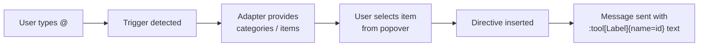

用户可以在输入框中输入 `@`，打开弹出选择器，选择一个项目（例如工具），并将指令插入消息文本。随后，LLM 可以将该指令用作提示。

## 工作原理



提及系统分为三层：

1. **触发检测** — 输入框会监视触发字符（默认为 `@`）并提取查询内容
2. **适配器** — 提供要在弹出层中显示的类别和项目（例如已注册的工具）
3. **格式化器** — 将选中的项目序列化为指令文本（`:type[label]{name=id}`），并将其解析回来以进行渲染

在底层，提及是[触发器弹出层](/docs/guides/slash-commands#trigger-popover-architecture)的一种。提及通过 `<TriggerPopover.Directive>` 子原语声明其行为；选择项目时，该原语会将经过格式化器序列化的指令写入输入框。

## 快速开始

最快的方式是使用预构建的 [Mention UI 组件](/elements/composer-trigger-popover)，它通过两个 shadcn 组件将所有内容连接起来——弹出选择器和消息侧的标签渲染器：

<InstallCommand shadcn={["composer-trigger-popover", "directive-text"]} />

有关设置步骤，请参阅 [Composer Trigger Popover](/elements/composer-trigger-popover) 和 [Directive Text](/elements/directive-text) 指南。

本指南的其余部分将介绍底层概念和可自定义的部分。

## 触发器适配器

`Unstable_TriggerAdapter` 为弹出层提供数据。所有方法都是**同步的**——对于异步数据，请使用外部状态管理（React Query、SWR、本地状态），然后通过适配器暴露已加载的结果。

```ts
import type { Unstable_TriggerAdapter } from "@assistant-ui/core";

const myAdapter: Unstable_TriggerAdapter = {
  categories() {
    return [
      { id: "tools", label: "Tools" },
      { id: "users", label: "Users" },
    ];
  },

  categoryItems(categoryId) {
    if (categoryId === "tools") {
      return [
        { id: "search", type: "tool", label: "Search" },
        { id: "calculator", type: "tool", label: "Calculator" },
      ];
    }
    if (categoryId === "users") {
      return [
        { id: "alice", type: "user", label: "Alice" },
        { id: "bob", type: "user", label: "Bob" },
      ];
    }
    return [];
  },

  // Optional — global search across all categories
  search(query) {
    const lower = query.toLowerCase();
    const all = [
      ...this.categoryItems("tools"),
      ...this.categoryItems("users"),
    ];
    return all.filter(
      (item) =>
        item.label.toLowerCase().includes(lower) ||
        item.id.toLowerCase().includes(lower),
    );
  },
};
```

### 异步提及搜索

内置的 `unstable_useLiveCompletionAdapter` 会为异步获取器提供防抖、过期请求取消（丢弃过时查询的结果）和单条目缓存。其 `search` 会同步返回上一次结果，并在查询发生变化时安排防抖获取；结果到达后，返回的 `adapter` 会重新创建，从而重新运行弹出层查找，使最新项目得以渲染。它还会报告 `isLoading`，你可以将其传递给弹出层以显示加载状态。

当获取器从特定账户或工作区的数据源读取数据时，请将该数据源 ID 作为 `cacheKey` 传入。更改该键会清除缓存结果，并取消来自之前数据源的任何待处理结果。

```tsx
import {
  unstable_useLiveCompletionAdapter,
  unstable_defaultDirectiveFormatter,
} from "@assistant-ui/react";
import { ComposerTriggerPopover } from "@/components/assistant-ui/elements/composer-trigger-popover.aui";

function MentionPopover() {
  const mentions = unstable_useLiveCompletionAdapter({
    fetcher: async (query) => {
      const users = await fetchUsers(query);
      return users.map((u) => ({ id: u.id, type: "user", label: u.name }));
    },
  });

  return (
    <ComposerTriggerPopover
      char="@"
      adapter={mentions.adapter}
      isLoading={mentions.isLoading}
      directive={{ formatter: unstable_defaultDirectiveFormatter }}
    />
  );
}
```

适配器接口本身是同步的，因此当你需要自定义缓存、不使用防抖或使用现有查询客户端时，也可以手动接入异步数据。将结果加载到 React 状态（或查询缓存）中，并在适配器方法中读取当前快照。适配器会在每次渲染时重新创建，因此弹出层始终可以看到最新结果。

**使用 React 状态和 `useEffect`：**

```tsx
import { useState, useEffect, useMemo } from "react";
import type { Unstable_TriggerAdapter } from "@assistant-ui/core";

function useUserMentionAdapter(query: string) {
  const [users, setUsers] = useState<{ id: string; name: string }[]>([]);

  useEffect(() => {
    if (!query) return;
    let cancelled = false;
    fetchUsers(query).then((results) => {
      if (!cancelled) setUsers(results);
    });
    return () => { cancelled = true; };
  }, [query]);

  const adapter: Unstable_TriggerAdapter = useMemo(() => ({
    categories: () => [],
    categoryItems: () => [],
    search: () =>
      users.map((u) => ({ id: u.id, type: "user", label: u.name })),
  }), [users]);

  return adapter;
}
```

这里的 `query` 是用户在 `@` 后输入的文本。如果需要在组件树中使用它，可以从 `unstable_useTriggerPopoverScopeContext` 读取，也可以将其作为状态从受控输入框传入。

**使用 React Query：**

```tsx
import { useQuery } from "@tanstack/react-query";
import type { Unstable_TriggerAdapter } from "@assistant-ui/core";

function useMentionAdapter(query: string): Unstable_TriggerAdapter {
  const { data = [] } = useQuery({
    queryKey: ["mention-search", query],
    queryFn: () => fetchUsers(query),
    enabled: query.length > 0,
  });

  return useMemo(() => ({
    categories: () => [],
    categoryItems: () => [],
    search: () =>
      data.map((u) => ({ id: u.id, type: "user", label: u.name })),
  }), [data]);
}
```

将适配器传递给 `TriggerPopover`，并声明一个 `Directive` 子原语来绑定插入行为：

```tsx
import { ComposerPrimitive } from "@assistant-ui/react";
import { unstable_defaultDirectiveFormatter } from "@assistant-ui/react";

<ComposerPrimitive.Unstable_TriggerPopoverRoot>
  <ComposerPrimitive.Root>
    <ComposerPrimitive.Input placeholder="Type @ to mention..." />
    <ComposerPrimitive.Unstable_TriggerPopover
      char="@"
      adapter={myAdapter}
    >
      <ComposerPrimitive.Unstable_TriggerPopover.Directive
        formatter={unstable_defaultDirectiveFormatter}
      />
      <ComposerPrimitive.Unstable_TriggerPopoverCategories>
        {(categories) =>
          categories.map((cat) => (
            <ComposerPrimitive.Unstable_TriggerPopoverCategoryItem
              key={cat.id}
              categoryId={cat.id}
            >
              {cat.label}
            </ComposerPrimitive.Unstable_TriggerPopoverCategoryItem>
          ))
        }
      </ComposerPrimitive.Unstable_TriggerPopoverCategories>
      <ComposerPrimitive.Unstable_TriggerPopoverItems>
        {(items) =>
          items.map((item) => (
            <ComposerPrimitive.Unstable_TriggerPopoverItem
              key={item.id}
              item={item}
            >
              {item.label}
            </ComposerPrimitive.Unstable_TriggerPopoverItem>
          ))
        }
      </ComposerPrimitive.Unstable_TriggerPopoverItems>
    </ComposerPrimitive.Unstable_TriggerPopover>
  </ComposerPrimitive.Root>
</ComposerPrimitive.Unstable_TriggerPopoverRoot>
```

每个 `TriggerPopover` 至多允许一个行为子原语（`Directive` 或 `Action`）。父级会读取已注册的行为，并连接选择机制。

### 内置提及适配器

`unstable_useMentionAdapter` 覆盖了常见场景：提及已注册的工具、添加自己的项目、将工具与自定义项目混合，或显示多类别的逐级选择。

**来自模型上下文的工具（默认）：**

```tsx
import { unstable_useMentionAdapter } from "@assistant-ui/react";

const mention = unstable_useMentionAdapter();
// → { adapter, directive } — spread into <ComposerTriggerPopover {...mention} />
// Default: single "Tools" category reading from toolkit registrations
```

**仅自定义项目（无工具）：**

```tsx
const mention = unstable_useMentionAdapter({
  items: [
    { id: "alice", type: "user", label: "Alice", icon: "User" },
    { id: "bob", type: "user", label: "Bob", icon: "User" },
  ],
});
```

**将自定义项目与模型上下文工具混合（平铺）：**

```tsx
const mention = unstable_useMentionAdapter({
  items: [{ id: "kb", type: "doc", label: "Knowledge Base", icon: "Book" }],
  includeModelContextTools: true,
});
```

**多类别逐级选择：**

```tsx
const mention = unstable_useMentionAdapter({
  categories: [
    {
      id: "users",
      label: "Users",
      items: [
        { id: "alice", type: "user", label: "Alice", icon: "User" },
        { id: "bob", type: "user", label: "Bob", icon: "User" },
      ],
    },
    {
      id: "files",
      label: "Files",
      items: [
        { id: "readme", type: "file", label: "README.md", icon: "FileText" },
      ],
    },
  ],
  // Tools auto-appended as their own category (default id "tools", label "Tools")
  includeModelContextTools: true,
});
```

**工具格式化和类别覆盖：**

```tsx
const mention = unstable_useMentionAdapter({
  categories: [{ id: "users", label: "Users", items: [...] }],
  includeModelContextTools: {
    category: { id: "integrations", label: "Integrations" },
    formatLabel: (name) =>
      name.replaceAll("_", " ").replace(/\b\w/g, (c) => c.toUpperCase()),
    icon: "Wrench",
  },
});
```

**选项摘要：**

| 选项 | 类型 | 行为 |
| --- | --- | --- |
| `items` | `Unstable_Mention[]` | 平铺列表（设置 `categories` 时忽略）；提供此选项后，即使配置了工具 `category`，适配器仍保持平铺 |
| `categories` | `{id, label, items}[]` | 逐级选择分组 |
| `includeModelContextTools` | `boolean \| object` | 默认值：仅当 `items` 和 `categories` 均未设置时为 `true`；对象 `category` 会自行选择逐级选择，除非提供了 `items` |
| `formatter` | `Unstable_DirectiveFormatter` | 覆盖指令序列化方式（默认值：`unstable_defaultDirectiveFormatter`） |
| `onInserted` | `(item) => void` | 指令插入输入框后触发 |
| `iconMap` | `Record<string, IconComponent>` | 将 `metadata.icon` / 类别 `id` 字符串映射到 React 组件 |
| `fallbackIcon` | `IconComponent` | 当 `iconMap` 中没有匹配项时使用的回退项 |

每个提及上的 `icon` 是 `metadata.icon` 的快捷方式，选择器 UI 会通过 `iconMap` 对其进行解析。自定义项目与模型上下文工具之间根据 `id` 去重——显式项目优先。

该 hook 返回 `{ adapter, directive, iconMap?, fallbackIcon? }`——将其展开到 `<ComposerTriggerPopover {...mention} />` 中即可用一行代码完成连接。直接使用底层原语的调用方则会解构出：`mention.adapter`、`mention.directive.formatter` 等。

## 指令格式

用户选择提及项目后，该项目会作为**指令**序列化到输入框文本中。默认格式为：

```
:type[label]{name=id}
```

例如，选择名称为 "get_weather"、标签为 "Get Weather" 的工具后，会生成：

```
:tool[Get Weather]{name=get_weather}
```

当 `id` 等于 `label` 时，为简洁起见会省略 `{name=…}` 属性：

```
:tool[search]
```

### 自定义格式化器

实现 `Unstable_DirectiveFormatter` 即可使用其他格式：

```ts
import type { Unstable_DirectiveFormatter } from "@assistant-ui/react";

const slashFormatter: Unstable_DirectiveFormatter = {
  serialize(item) {
    return `/${item.id}`;
  },

  parse(text) {
    const segments = [];
    const re = /\/(\w+)/g;
    let lastIndex = 0;
    let match;

    while ((match = re.exec(text)) !== null) {
      if (match.index > lastIndex) {
        segments.push({ kind: "text" as const, text: text.slice(lastIndex, match.index) });
      }
      segments.push({
        kind: "mention" as const,
        type: "tool",
        label: match[1]!,
        id: match[1]!,
      });
      lastIndex = re.lastIndex;
    }

    if (lastIndex < text.length) {
      segments.push({ kind: "text" as const, text: text.slice(lastIndex) });
    }

    return segments;
  },
};
```

将其传递给触发器的 `Directive` 子原语和消息渲染器：

```tsx
// Composer
<ComposerPrimitive.Unstable_TriggerPopover
  char="@"
  adapter={adapter}
>
  <ComposerPrimitive.Unstable_TriggerPopover.Directive formatter={slashFormatter} />
  ...
</ComposerPrimitive.Unstable_TriggerPopover>

// User messages
const SlashDirectiveText = createDirectiveText(slashFormatter);
<MessagePrimitive.Parts components={{ Text: SlashDirectiveText }} />
```

## Textarea 与 Lexical

提及系统支持两种输入模式：

| | Textarea（默认） | Lexical |
| --- | --- | --- |
| **输入组件** | `ComposerPrimitive.Input` | `LexicalComposerInput` |
| **提及在输入框中的显示方式** | 原始指令文本（`:tool[Label]`） | 内联标签（原子节点） |
| **依赖** | 无 | `@assistant-ui/react-lexical`、`lexical`、`@lexical/react` |
| **适用场景** | 简单配置、最小化包体积 | 富文本编辑、精致的用户体验 |

使用 **textarea** 时，选择提及会直接将指令字符串插入文本。用户会在输入框中看到 `:tool[Get Weather]{name=get_weather}`。

使用 **Lexical** 时，选中的提及会显示为带样式的内联标签，并作为原子单元运行——可以整体选中、删除和撤销。底层文本仍然使用指令格式。

```tsx
import { LexicalComposerInput } from "@assistant-ui/react-lexical";

<ComposerPrimitive.Unstable_TriggerPopoverRoot>
  <ComposerPrimitive.Root>
    <LexicalComposerInput placeholder="Type @ to mention..." />
    <ComposerPrimitive.Send />
    <ComposerPrimitive.Unstable_TriggerPopover
      char="@"
      adapter={adapter}
    >
      <ComposerPrimitive.Unstable_TriggerPopover.Directive formatter={formatter} />
      ...
    </ComposerPrimitive.Unstable_TriggerPopover>
  </ComposerPrimitive.Root>
</ComposerPrimitive.Unstable_TriggerPopoverRoot>
```

`LexicalComposerInput` 会自动发现注册在 `TriggerPopoverRoot` 下的每个 `Directive` 触发器，并将它们的选择渲染为内联标签。

### 自定义 Lexical 插件

`LexicalComposerInput` 的子元素会在内置插件之后渲染到 `LexicalComposer` 上下文中，因此，基于 `useLexicalComposerContext` 构建的标准 Lexical 插件组件可以处理提及系统未覆盖的编辑器功能，例如粘贴规范化或长度限制。自定义插件会直接导入 Lexical API，因此请将 `lexical` 和 `@lexical/react` 作为应用的直接依赖安装。下面的示例注册了一个更新监听器，用于标记超过最大长度的消息。

```tsx
import { useLexicalComposerContext } from "@lexical/react/LexicalComposerContext";
import { useEffect } from "react";
import { $getRoot } from "lexical";

function MaxLengthPlugin({ maxLength }: { maxLength: number }) {
  const [editor] = useLexicalComposerContext();

  useEffect(() => {
    return editor.registerUpdateListener(({ editorState }) => {
      editorState.read(() => {
        if ($getRoot().getTextContent().length > maxLength) {
          console.warn(`Message exceeds ${maxLength} characters`);
        }
      });
    });
  }, [editor, maxLength]);

  return null;
}

<LexicalComposerInput placeholder="Ask anything...">
  <MaxLengthPlugin maxLength={2000} />
</LexicalComposerInput>
```

## 在消息中渲染提及

对于用户消息，使用 `DirectiveText` 作为 `Text` 组件，使指令渲染为内联标签，而不是原始语法。有关设置和自定义，请参阅 [Directive Text](/elements/directive-text) 指南。

## 在后端处理提及

消息文本到达后端时，其中会内联包含指令。解析这些指令以提取被提及的项目：

```ts
// Default format: :type[label]{name=id}
const DIRECTIVE_RE = /:([\w-]+)\[([^\]]+)\](?:\{name=([^}]+)\})?/g;

function parseMentions(text: string) {
  const mentions = [];
  let match;
  while ((match = DIRECTIVE_RE.exec(text)) !== null) {
    mentions.push({
      type: match[1],        // e.g. "tool"
      label: match[2],       // e.g. "Get Weather"
      id: match[3] ?? match[2], // e.g. "get_weather"
    });
  }
  return mentions;
}

// Example:
// parseMentions("Use :tool[Get Weather]{name=get_weather} to check")
// → [{ type: "tool", label: "Get Weather", id: "get_weather" }]
```

你可以使用提取出的提及来：
- 为 LLM 调用强制启用特定工具
- 将被提及用户或文档的上下文添加到系统提示词中
- 记录用户最常请求哪些工具

## 读取提及状态

在 `TriggerPopover` 中使用 `unstable_useTriggerPopoverScopeContext`，即可通过编程方式访问该触发器的弹出层状态：

```tsx
import { unstable_useTriggerPopoverScopeContext } from "@assistant-ui/react";

function MyPopoverContent() {
  const scope = unstable_useTriggerPopoverScopeContext();

  // scope.open — whether the popover is visible
  // scope.query — current search text after the trigger
  // scope.categories — filtered category list
  // scope.items — filtered item list
  // scope.highlightedIndex — keyboard-navigated index
  // scope.isSearchMode — true when global search is active
  // scope.selectItem(item) — programmatically select an item
  // scope.close() — close the popover

  return null;
}
```

此 hook 必须在 `ComposerPrimitive.Unstable_TriggerPopover` 内使用。

若要遍历每个已注册的触发器（例如从自定义输入实现中遍历），请在 `TriggerPopoverRoot` 中使用 `unstable_useTriggerPopoverTriggers`。

## 构建自定义弹出层

使用触发器弹出层原语来构建完全自定义的弹出层：

```tsx
<ComposerPrimitive.Unstable_TriggerPopoverRoot>
  <ComposerPrimitive.Root>
    <ComposerPrimitive.Input />

    <ComposerPrimitive.Unstable_TriggerPopover
      char="@"
      adapter={adapter}
      className="popover"
    >
      <ComposerPrimitive.Unstable_TriggerPopover.Directive formatter={formatter} />

      <ComposerPrimitive.Unstable_TriggerPopoverBack>
        ← Back
      </ComposerPrimitive.Unstable_TriggerPopoverBack>

      <ComposerPrimitive.Unstable_TriggerPopoverCategories>
        {(categories) =>
          categories.map((cat) => (
            <ComposerPrimitive.Unstable_TriggerPopoverCategoryItem
              key={cat.id}
              categoryId={cat.id}
            >
              {cat.label}
            </ComposerPrimitive.Unstable_TriggerPopoverCategoryItem>
          ))
        }
      </ComposerPrimitive.Unstable_TriggerPopoverCategories>

      <ComposerPrimitive.Unstable_TriggerPopoverItems>
        {(items) =>
          items.map((item) => (
            <ComposerPrimitive.Unstable_TriggerPopoverItem
              key={item.id}
              item={item}
            >
              {item.label}
            </ComposerPrimitive.Unstable_TriggerPopoverItem>
          ))
        }
      </ComposerPrimitive.Unstable_TriggerPopoverItems>
    </ComposerPrimitive.Unstable_TriggerPopover>

    <ComposerPrimitive.Send />
  </ComposerPrimitive.Root>
</ComposerPrimitive.Unstable_TriggerPopoverRoot>
```

### 原语参考

完整的触发器弹出层原语及其 props 列表，请参阅 [Composer Primitives](/docs/primitives/composer) 参考。

## 与斜杠命令结合使用

提及和斜杠命令可以共存于同一个输入框中。完整模式请参阅[组合斜杠命令与提及](/docs/guides/slash-commands#combining-with-mentions)。

## 相关内容

- [ComposerTriggerPopover UI 组件](/elements/composer-trigger-popover) — 预构建的 shadcn 组件
- [DirectiveText UI 组件](/elements/directive-text) — 在用户消息中渲染提及标签
- [斜杠命令指南](/docs/guides/slash-commands) — `/` 命令系统，基于相同架构构建
- [工具指南](/docs/tools/defining-tools) — 注册显示在提及选择器中的工具
- [Composer Primitives](/docs/primitives/composer) — 底层输入框原语
