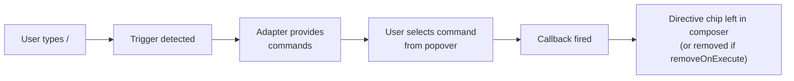

斜杠命令允许用户在输入框中输入 `/`，打开弹出层、浏览可用命令并执行其中一个命令。与 [提及](/docs/guides/mentions) 不同，提及只会将指令插入消息，而斜杠命令还会在选中时触发 **操作回调**。

## 工作原理



斜杠命令系统与提及使用相同的[触发器弹出层架构](#trigger-popover-architecture)。斜杠命令通过 `<TriggerPopover.Action>` 子原语声明其行为，其中的 `onExecute` 回调会在选中某个项目时触发。

默认情况下，`Action` 会在输入框中保留一个指令标签，让用户（以及 LLM）能够追溯调用过哪些命令。传入 `removeOnExecute` 可完全移除 `/command` 文本。

## 快速开始

### 1. 使用 `unstable_useSlashCommandAdapter` 定义命令

声明命令（将数据与 `execute` 组合在一起，类似工具包条目）。该 Hook 返回 `{ adapter, action }`，将两者连接到同一个 `<TriggerPopover>` 中：

```tsx
import {
  ComposerPrimitive,
  unstable_useSlashCommandAdapter,
  type Unstable_SlashCommand,
} from "@assistant-ui/react";

const SLASH_COMMANDS: readonly Unstable_SlashCommand[] = [
  {
    id: "summarize",
    description: "Summarize the conversation",
    execute: () => console.log("Summarize!"),
  },
  {
    id: "translate",
    description: "Translate text to another language",
    execute: () => console.log("Translate!"),
  },
  {
    id: "help",
    description: "List all available commands",
    execute: () => console.log("Help!"),
  },
];

function MyComposer() {
  const slash = unstable_useSlashCommandAdapter({ commands: SLASH_COMMANDS });

  return (
    <ComposerPrimitive.Unstable_TriggerPopoverRoot>
      <ComposerPrimitive.Root>
        <ComposerPrimitive.Input placeholder="Type / for commands..." />
        <ComposerPrimitive.Send>Send</ComposerPrimitive.Send>

        <ComposerPrimitive.Unstable_TriggerPopover
          char="/"
          adapter={slash.adapter}
          className="popover"
        >
          <ComposerPrimitive.Unstable_TriggerPopover.Action {...slash.action} />
          <ComposerPrimitive.Unstable_TriggerPopoverItems>
            {(items) =>
              items.map((item, index) => (
                <ComposerPrimitive.Unstable_TriggerPopoverItem
                  key={item.id}
                  item={item}
                  index={index}
                  className="popover-item"
                >
                  <strong>{item.label}</strong>
                  {item.description && <span>{item.description}</span>}
                </ComposerPrimitive.Unstable_TriggerPopoverItem>
              ))
            }
          </ComposerPrimitive.Unstable_TriggerPopoverItems>
        </ComposerPrimitive.Unstable_TriggerPopover>
      </ComposerPrimitive.Root>
    </ComposerPrimitive.Unstable_TriggerPopoverRoot>
  );
}
```

标签默认为 `/${id}`；可通过命令上的 `label` 覆盖。图标是字符串，选择器 UI 中的 `iconMap` 会将其解析为组件（参见 [ComposerTriggerPopover](/elements/composer-trigger-popover)）。

### `unstable_useSlashCommandAdapter` 选项

| 选项 | 类型 | 默认值 | 描述 |
| --- | --- | --- | --- |
| `commands` | `Unstable_SlashCommand[]` | — | 命令定义——每个定义都包含 `id`，以及可选的 `label`、`description`、`icon` 和一个 `execute` 回调（必需） |
| `removeOnExecute` | `boolean` | `false` | 当 `true` 时，执行后会从输入框中移除触发文本，而不是留下指令标签 |
| `iconMap` | `Record<string, IconComponent>` | — | 将 `metadata.icon` / 类别 `id` 字符串映射到 React 图标组件；转发给 `ComposerTriggerPopover` |
| `fallbackIcon` | `IconComponent` | — | 没有匹配的 `iconMap` 条目时使用的回退项；转发给 `ComposerTriggerPopover` |

该 Hook 返回 `{ adapter, action, iconMap?, fallbackIcon? }`，可直接展开到 `<ComposerTriggerPopover char="/" {...slash} />` 中，实现单行连接。

### 2. 控制标签

默认情况下，选中的 `/summarize` 会在输入框文本中转换为指令标签（`:command[/summarize]{name=summarize}`），并触发命令的 `execute`。这样可以保留调用过哪些命令的审计记录。

如需完全移除触发文本（适用于纯临时命令），请在 Hook 选项中传入 `removeOnExecute`：

```tsx
const slash = unstable_useSlashCommandAdapter({
  commands: SLASH_COMMANDS,
  removeOnExecute: true,
});
```

### 3. 自定义分发

如需在 `execute` 之上添加副作用（日志记录、分析或拦截），可以包装该 Hook 的 `onExecute`：

```tsx
<ComposerPrimitive.Unstable_TriggerPopover.Action
  onExecute={(item) => {
    logCommandUsed(item.id);
    slash.action.onExecute(item);
  }}
/>
```

## 分类命令

对于**分类导航**（深入浏览各个分组），请从 `categories()` 返回类别，并从 `categoryItems()` 返回项目。弹出层会先显示类别，再显示所选类别中的项目：

```ts
import type { Unstable_TriggerAdapter } from "@assistant-ui/core";

const adapter: Unstable_TriggerAdapter = {
  categories() {
    return [
      { id: "actions", label: "Actions" },
      { id: "export", label: "Export" },
    ];
  },

  categoryItems(categoryId) {
    if (categoryId === "actions") {
      return [
        { id: "summarize", type: "command", label: "/summarize", description: "Summarize the conversation" },
        { id: "translate", type: "command", label: "/translate", description: "Translate text" },
      ];
    }
    if (categoryId === "export") {
      return [
        { id: "pdf", type: "command", label: "/export pdf", description: "Export as PDF" },
        { id: "markdown", type: "command", label: "/export md", description: "Export as Markdown" },
      ];
    }
    return [];
  },

  // Optional — enables search across all categories
  search(query) {
    const lower = query.toLowerCase();
    const all = [...this.categoryItems("actions"), ...this.categoryItems("export")];
    return all.filter(
      (item) => item.label.toLowerCase().includes(lower) || item.description?.toLowerCase().includes(lower),
    );
  },
};
```

使用分类适配器时，请将 `TriggerPopoverCategories` 添加到弹出层 UI：

```tsx
const commandHandlers: Record<string, () => void> = {
  summarize: () => {/* ... */},
  pdf: () => {/* ... */},
};

<ComposerPrimitive.Unstable_TriggerPopover
  char="/"
  adapter={adapter}
>
  <ComposerPrimitive.Unstable_TriggerPopover.Action
    formatter={unstable_defaultDirectiveFormatter}
    onExecute={(item) => commandHandlers[item.id]?.()}
  />
  <ComposerPrimitive.Unstable_TriggerPopoverBack>← Back</ComposerPrimitive.Unstable_TriggerPopoverBack>
  <ComposerPrimitive.Unstable_TriggerPopoverCategories>
    {(categories) => categories.map((cat) => (
      <ComposerPrimitive.Unstable_TriggerPopoverCategoryItem key={cat.id} categoryId={cat.id}>
        {cat.label}
      </ComposerPrimitive.Unstable_TriggerPopoverCategoryItem>
    ))}
  </ComposerPrimitive.Unstable_TriggerPopoverCategories>
  <ComposerPrimitive.Unstable_TriggerPopoverItems>
    {(items) => items.map((item, index) => (
      <ComposerPrimitive.Unstable_TriggerPopoverItem key={item.id} item={item} index={index}>
        {item.label}
      </ComposerPrimitive.Unstable_TriggerPopoverItem>
    ))}
  </ComposerPrimitive.Unstable_TriggerPopoverItems>
</ComposerPrimitive.Unstable_TriggerPopover>
```

## 与提及结合使用

斜杠命令和提及位于同一个 `TriggerPopoverRoot` 下。请为每个触发器声明一个 `TriggerPopover`，并为其配置各自的行为子原语：

```tsx
<ComposerPrimitive.Unstable_TriggerPopoverRoot>
  <ComposerPrimitive.Root>
    <ComposerPrimitive.Input placeholder="Type @ to mention, / for commands..." />
    <ComposerPrimitive.Send>Send</ComposerPrimitive.Send>

    {/* @ mention popover */}
    <ComposerPrimitive.Unstable_TriggerPopover
      char="@"
      adapter={mention.adapter}
    >
      <ComposerPrimitive.Unstable_TriggerPopover.Directive {...mention.directive} />
      <ComposerPrimitive.Unstable_TriggerPopoverItems>
        {(items) => items.map((item) => (
          <ComposerPrimitive.Unstable_TriggerPopoverItem key={item.id} item={item}>
            {item.label}
          </ComposerPrimitive.Unstable_TriggerPopoverItem>
        ))}
      </ComposerPrimitive.Unstable_TriggerPopoverItems>
    </ComposerPrimitive.Unstable_TriggerPopover>

    {/* / slash command popover */}
    <ComposerPrimitive.Unstable_TriggerPopover
      char="/"
      adapter={slash.adapter}
    >
      <ComposerPrimitive.Unstable_TriggerPopover.Action {...slash.action} />
      <ComposerPrimitive.Unstable_TriggerPopoverItems>
        {(items) => items.map((item, index) => (
          <ComposerPrimitive.Unstable_TriggerPopoverItem key={item.id} item={item} index={index}>
            {item.label}
          </ComposerPrimitive.Unstable_TriggerPopoverItem>
        ))}
      </ComposerPrimitive.Unstable_TriggerPopoverItems>
    </ComposerPrimitive.Unstable_TriggerPopover>
  </ComposerPrimitive.Root>
</ComposerPrimitive.Unstable_TriggerPopoverRoot>
```

每个 `TriggerPopover` 都有自己的作用域——`@` 弹出层和 `/` 弹出层会读取各自声明中的状态，彼此不会冲突。键盘事件会路由到当前处于活动状态的弹出层。

## 带参数的命令

某些命令支持在命令词后输入内联参数，例如 `/translate en` 或 `/ask what is TypeScript`。由于适配器的 `search` 方法会接收 `/` 之后的完整文本，因此可以按第一个空格进行拆分，将命令与参数分开：

```tsx
const SLASH_COMMANDS: readonly Unstable_SlashCommand[] = [
  {
    id: "translate",
    description: "Translate to a language, e.g. /translate en",
    execute: () => {/* arguments extracted separately, see below */},
  },
  {
    id: "ask",
    description: "Ask about a topic, e.g. /ask what is TypeScript",
    execute: () => {/* arguments extracted separately, see below */},
  },
];

function MyComposer() {
  const composerRef = useRef<HTMLTextAreaElement>(null);
  const slash = unstable_useSlashCommandAdapter({
    commands: SLASH_COMMANDS.map((cmd) => ({
      ...cmd,
      execute: () => {
        // Read the full composer text to extract arguments
        const raw = composerRef.current?.value ?? "";
        // Match "/<id> <args>" at start of input
        const match = raw.match(new RegExp(`^\\/${cmd.id}\\s+(.*)`));
        const args = match?.[1]?.trim() ?? "";
        handleCommand(cmd.id, args);
      },
    })),
    removeOnExecute: true,
  });

  return (
    <ComposerPrimitive.Unstable_TriggerPopoverRoot>
      <ComposerPrimitive.Root>
        <ComposerPrimitive.Input ref={composerRef} placeholder="Type / for commands..." />
        <ComposerPrimitive.Unstable_TriggerPopover char="/" adapter={slash.adapter}>
          <ComposerPrimitive.Unstable_TriggerPopover.Action {...slash.action} />
          <ComposerPrimitive.Unstable_TriggerPopoverItems>
            {(items) => items.map((item, i) => (
              <ComposerPrimitive.Unstable_TriggerPopoverItem key={item.id} item={item} index={i}>
                <strong>{item.label}</strong>
                {item.description && <span>{item.description}</span>}
              </ComposerPrimitive.Unstable_TriggerPopoverItem>
            ))}
          </ComposerPrimitive.Unstable_TriggerPopoverItems>
        </ComposerPrimitive.Unstable_TriggerPopover>
        <ComposerPrimitive.Send>Send</ComposerPrimitive.Send>
      </ComposerPrimitive.Root>
    </ComposerPrimitive.Unstable_TriggerPopoverRoot>
  );
}
```

`removeOnExecute: true` 会从输入框中移除 `/translate en` 文本，使参数由处理器消费，而不是发送给 LLM。

## 异步加载命令

适配器接口是同步的，但命令列表可以来自任何异步源。将命令加载到状态（或查询缓存）中，并将当前快照传递给 Hook。由于 `unstable_useSlashCommandAdapter` 会在每次渲染时重新运行，适配器始终反映最新列表。

**使用 React 状态：**

```tsx
function MyComposer() {
  const [commands, setCommands] = useState<Unstable_SlashCommand[]>([]);

  useEffect(() => {
    fetchAvailableCommands().then(setCommands);
  }, []);

  const slash = unstable_useSlashCommandAdapter({ commands });

  return (/* ... */);
}
```

**使用 React Query：**

```tsx
function MyComposer() {
  const { data: commands = [] } = useQuery({
    queryKey: ["slash-commands"],
    queryFn: fetchAvailableCommands,
  });

  const slash = unstable_useSlashCommandAdapter({ commands });

  return (/* ... */);
}
```

## 键盘导航

完整的按键绑定表请参阅 [ComposerTriggerPopover 键盘导航](/elements/composer-trigger-popover#keyboard-navigation)。

## 触发器弹出层架构

提及和斜杠命令都构建在通用的触发器弹出层系统之上。在该系统中，每个 `Unstable_TriggerPopover` 都会声明一个触发字符、一个适配器，以及且仅有一个行为子原语（`Directive` 或 `Action`）。多个触发器可以共存于同一个 `Unstable_TriggerPopoverRoot` 下。完整 API 请参阅 [输入框原语](/docs/primitives/composer)参考。

## 原语参考

完整的触发器弹出层原语及其 props 列表请参阅[输入框原语](/docs/primitives/composer)参考。

## 相关内容

- [提及指南](/docs/guides/mentions) — 基于相同架构构建的 `@`-mention 系统
- [建议指南](/docs/guides/suggestions) — 静态后续提示（不同于斜杠命令）
- [输入框原语](/docs/primitives/composer) — 底层输入框原语
