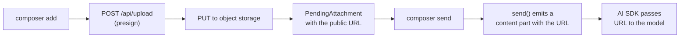

内置的 `SimpleImageAttachmentAdapter` 和 `SimpleTextAttachmentAdapter` 会将文件以内联数据 URL 的形式发送。对于较小的图片和文本文件，这种方式可行；但对于大文件、持久化线程以及无服务器环境的请求体大小限制，就不再适用。本页面介绍生产环境中的实现模式：使用一个 `AttachmentAdapter` 通过预签名 URL 将文件上传到对象存储，并且只将 URL 发送给模型。

如需了解适配器契约本身，请参阅 [适配器](/docs/runtimes/concepts/adapters#attachment-adapter)。本页面介绍存储变体。

## 工作原理



阅读代码前，请先理解以下三个要点：

1. **`add` 负责上传，并返回 `requires-action`。** 输入框会将文件与用户的其他输入一起保存。
2. **`send` 负责完成处理。** 用户提交时，将附件标记为 `complete`，并发出包含稳定 URL 的 `content` 部分。
3. **`remove` 负责删除。** 可选操作。仅当用户在发送前从输入框中移除附件时才会执行；已经发送的消息不可变。

## 设置

<Steps>
<Step>

### 构建预签名端点

客户端无法安全地生成上传凭据；服务器会创建一个短时有效的预签名 URL。下面的示例使用 S3，但 R2、GCS 和 Vercel Blob 的实现形式几乎相同。

```sh title=".env.local"
AWS_REGION=us-east-1
S3_BUCKET=my-chat-uploads
AWS_ACCESS_KEY_ID=...
AWS_SECRET_ACCESS_KEY=...
```

```ts title="app/api/upload/route.ts"
import { S3Client, PutObjectCommand, DeleteObjectCommand } from "@aws-sdk/client-s3";
import { getSignedUrl } from "@aws-sdk/s3-request-presigner";
import { auth } from "@/auth";
import { generateId } from "ai";

const s3 = new S3Client({ region: process.env.AWS_REGION });

export async function POST(req: Request) {
  const session = await auth();
  if (!session?.user) return new Response(null, { status: 401 });

  const { name, contentType } = (await req.json()) as {
    name: string;
    contentType: string;
  };

  const key = `chat-uploads/${generateId()}-${name}`;
  const url = await getSignedUrl(
    s3,
    new PutObjectCommand({
      Bucket: process.env.S3_BUCKET!,
      Key: key,
      ContentType: contentType,
    }),
    { expiresIn: 60 },
  );

  const publicUrl = `https://${process.env.S3_BUCKET}.s3.amazonaws.com/${key}`;
  return Response.json({ uploadUrl: url, publicUrl, key });
}
```

请在此处验证请求身份。有效期为 60 秒的预签名 URL 仍然是一项写入权限；只有经过身份验证的用户才能生成它们。

要使 `remove()` 从头到尾正常工作，还需要提供删除路由：

```ts title="app/api/upload/[key]/route.ts"
import { S3Client, DeleteObjectCommand } from "@aws-sdk/client-s3";
import { auth } from "@/auth";

const s3 = new S3Client({ region: process.env.AWS_REGION });

export async function DELETE(
  _req: Request,
  { params }: { params: Promise<{ key: string }> },
) {
  const session = await auth();
  if (!session?.user) return new Response(null, { status: 401 });

  const { key } = await params;
  await s3.send(
    new DeleteObjectCommand({
      Bucket: process.env.S3_BUCKET!,
      Key: decodeURIComponent(key),
    }),
  );
  return new Response(null, { status: 204 });
}
```

</Step>
<Step>

### 实现适配器

<PlatformTabs>
<Tab value="React">

```tsx title="app/runtime/attachment-adapter.ts"
import type {
  AttachmentAdapter,
  PendingAttachment,
  CompleteAttachment,
} from "@assistant-ui/react";

type Pending = PendingAttachment & { key: string; url: string };

export const attachmentAdapter: AttachmentAdapter = {
  accept: "image/*,application/pdf",

  async add({ file }) {
    const presign = await fetch("/api/upload", {
      method: "POST",
      headers: { "content-type": "application/json" },
      body: JSON.stringify({ name: file.name, contentType: file.type }),
    }).then((r) => r.json());

    const put = await fetch(presign.uploadUrl, {
      method: "PUT",
      headers: { "content-type": file.type },
      body: file,
    });
    if (!put.ok) throw new Error(`upload failed: ${put.status}`);

    const pending: Pending = {
      id: presign.key,
      type: file.type.startsWith("image/") ? "image" : "document",
      name: file.name,
      contentType: file.type,
      file,
      url: presign.publicUrl,
      key: presign.key,
      status: { type: "requires-action", reason: "composer-send" },
    };
    return pending;
  },

  async send(attachment): Promise<CompleteAttachment> {
    const { url, type, name, contentType } = attachment as Pending;

    const content =
      type === "image"
        ? [{ type: "image" as const, image: url }]
        : [
            {
              type: "file" as const,
              filename: name,
              mimeType: contentType ?? "application/octet-stream",
              data: url,
            },
          ];

    return { ...attachment, status: { type: "complete" }, content };
  },

  async remove(attachment) {
    await fetch(`/api/upload/${(attachment as Pending).key}`, {
      method: "DELETE",
    });
  },
};
```

</Tab>
<Tab value="React Native">

在 React Native 中，选择器（例如 `expo-document-picker`、`expo-image-picker`）会返回一个 `{ uri, name, mimeType }` 对象。将其包装为具有 `File` 形状的对象，然后再交给输入框：

```tsx title="runtime/attachment-adapter.ts"
import type {
  AttachmentAdapter,
  PendingAttachment,
  CompleteAttachment,
} from "@assistant-ui/react-native";

type Pending = PendingAttachment & { key: string; url: string };

export const attachmentAdapter: AttachmentAdapter = {
  accept: "image/*,application/pdf",

  async add({ file }) {
    const presign = await fetch(`${API_URL}/upload`, {
      method: "POST",
      headers: { "content-type": "application/json" },
      body: JSON.stringify({ name: file.name, contentType: file.type }),
    }).then((r) => r.json());

    const blob = await fetch((file as any).uri).then((r) => r.blob());
    const put = await fetch(presign.uploadUrl, {
      method: "PUT",
      headers: { "content-type": file.type },
      body: blob,
    });
    if (!put.ok) throw new Error(`upload failed: ${put.status}`);

    const pending: Pending = {
      id: presign.key,
      type: file.type.startsWith("image/") ? "image" : "document",
      name: file.name,
      contentType: file.type,
      file,
      url: presign.publicUrl,
      key: presign.key,
      status: { type: "requires-action", reason: "composer-send" },
    };
    return pending;
  },

  async send(attachment): Promise<CompleteAttachment> {
    const { url, type, name, contentType } = attachment as Pending;

    const content =
      type === "image"
        ? [{ type: "image" as const, image: url }]
        : [
            {
              type: "file" as const,
              filename: name,
              mimeType: contentType ?? "application/octet-stream",
              data: url,
            },
          ];

    return { ...attachment, status: { type: "complete" }, content };
  },

  async remove(attachment) {
    await fetch(`${API_URL}/upload/${(attachment as Pending).key}`, {
      method: "DELETE",
    });
  },
};
```

选择器结果包含一个 `uri`（file://… 或 content://…）。`fetch(uri)` 会将其读取为存储后端接受的 Blob。

</Tab>
<Tab value="React Ink">

在 Ink 中，用户输入路径；上传前先从磁盘读取该文件。

```tsx title="runtime/attachment-adapter.ts"
import type {
  AttachmentAdapter,
  PendingAttachment,
  CompleteAttachment,
} from "@assistant-ui/react-ink";
import { readFile } from "node:fs/promises";
import { basename } from "node:path";

type Pending = PendingAttachment & { key: string; url: string };

export const attachmentAdapter: AttachmentAdapter = {
  accept: "image/*,application/pdf",

  async add({ file }) {
    const path = (file as any).path as string;
    const name = file.name ?? basename(path);
    const contentType = file.type ?? "application/octet-stream";

    const presign = await fetch(`${API_URL}/upload`, {
      method: "POST",
      headers: { "content-type": "application/json" },
      body: JSON.stringify({ name, contentType }),
    }).then((r) => r.json());

    const buffer = await readFile(path);
    const put = await fetch(presign.uploadUrl, {
      method: "PUT",
      headers: { "content-type": contentType },
      body: buffer,
    });
    if (!put.ok) throw new Error(`upload failed: ${put.status}`);

    const pending: Pending = {
      id: presign.key,
      type: contentType.startsWith("image/") ? "image" : "document",
      name,
      contentType,
      file,
      url: presign.publicUrl,
      key: presign.key,
      status: { type: "requires-action", reason: "composer-send" },
    };
    return pending;
  },

  async send(attachment): Promise<CompleteAttachment> {
    const { url, type, name, contentType } = attachment as Pending;

    const content =
      type === "image"
        ? [{ type: "image" as const, image: url }]
        : [
            {
              type: "file" as const,
              filename: name,
              mimeType: contentType ?? "application/octet-stream",
              data: url,
            },
          ];

    return { ...attachment, status: { type: "complete" }, content };
  },

  async remove(attachment) {
    await fetch(`${API_URL}/upload/${(attachment as Pending).key}`, {
      method: "DELETE",
    });
  },
};
```

`file.path` 是输入提示从用户处收集的内容（经过波浪号展开的绝对路径）。Node 20+ 会在全局提供 `fetch`。

</Tab>
</PlatformTabs>

`content` 的形状与 AI SDK 的部分类型一致。图片使用 `image`，其他内容使用 `file`；AI SDK 会将它们转发给接受基于 URL 内容的多模态模型。

</Step>
<Step>

### 接入运行时

<PlatformTabs>
<Tab value="React">

```tsx title="app/runtime/MyProvider.tsx"
"use client";

import { AssistantRuntimeProvider } from "@assistant-ui/react";
import { useChatRuntime } from "@assistant-ui/ai-sdk";
import { attachmentAdapter } from "./attachment-adapter";

export function MyProvider({ children }: { children: React.ReactNode }) {
  const runtime = useChatRuntime({
    adapters: { attachments: attachmentAdapter },
  });
  return (
    <AssistantRuntimeProvider runtime={runtime}>
      {children}
    </AssistantRuntimeProvider>
  );
}
```

</Tab>
<Tab value="React Native">

```tsx title="runtime/MyProvider.tsx"
import { AssistantRuntimeProvider } from "@assistant-ui/react-native";
import {
  AssistantChatTransport,
  useChatRuntime,
} from "@assistant-ui/ai-sdk";
import { attachmentAdapter } from "./attachment-adapter";

export function MyProvider({ children }: { children: React.ReactNode }) {
  const runtime = useChatRuntime({
    transport: new AssistantChatTransport({ api: `${API_URL}/chat` }),
    adapters: { attachments: attachmentAdapter },
  });
  return (
    <AssistantRuntimeProvider runtime={runtime}>
      {children}
    </AssistantRuntimeProvider>
  );
}
```

</Tab>
<Tab value="React Ink">

```tsx title="runtime/MyProvider.tsx"
import { AssistantRuntimeProvider } from "@assistant-ui/react-ink";
import {
  AssistantChatTransport,
  useChatRuntime,
} from "@assistant-ui/ai-sdk";
import { attachmentAdapter } from "./attachment-adapter";

export function MyProvider({ children }: { children: React.ReactNode }) {
  const runtime = useChatRuntime({
    transport: new AssistantChatTransport({ api: `${API_URL}/chat` }),
    adapters: { attachments: attachmentAdapter },
  });
  return (
    <AssistantRuntimeProvider runtime={runtime}>
      {children}
    </AssistantRuntimeProvider>
  );
}
```

</Tab>
</PlatformTabs>

在内置输入框 UI 的平台上，输入框的回形针按钮会自动出现。`accept` 字符串用于筛选文件选择器中的文件。

</Step>
<Step>

### 运行并验证

选择一个文件，然后检查：

- Network 标签页显示 `POST /api/upload` 返回预签名 URL，随后向存储主机发出 `PUT`。
- 文件处于 `requires-action` 状态时，输入框会显示缩略图或标签。
- 提交消息时，请求体会将 URL（而不是文件字节）发送到 `/api/chat`。
- 对象存储中存在位于 `chat-uploads/...` 下的文件。

</Step>
</Steps>

## 变体

`add()` 的请求体是每个提供商唯一需要变化的部分。下面的选项卡展示上传步骤；其他所有内容（预签名端点、`send`、`remove` 和运行时接入）都相同。

<Tabs items={["S3 / R2", "Vercel Blob", "Uploadthing"]}>
<Tab value="S3 / R2">

上面的示例使用了 S3。R2 与 S3 API 兼容，因此只需替换端点：

```ts
const s3 = new S3Client({
  region: "auto",
  endpoint: `https://${process.env.R2_ACCOUNT_ID}.r2.cloudflarestorage.com`,
  credentials: {
    accessKeyId: process.env.R2_ACCESS_KEY_ID!,
    secretAccessKey: process.env.R2_SECRET_ACCESS_KEY!,
  },
});
```

</Tab>
<Tab value="Vercel Blob">

Vercel Blob 使用携带服务器签发令牌的客户端上传，而不是直接使用预签名 PUT。

```ts title="app/api/upload/route.ts"
import { handleUpload, type HandleUploadBody } from "@vercel/blob/client";

export async function POST(req: Request) {
  const body = (await req.json()) as HandleUploadBody;
  const json = await handleUpload({
    body,
    request: req,
    onBeforeGenerateToken: async () => ({
      allowedContentTypes: ["image/*", "application/pdf"],
    }),
    onUploadCompleted: async () => {},
  });
  return Response.json(json);
}
```

在适配器的 `add` 中，从 `@vercel/blob/client` 调用 `upload(name, file, { access: "public", handleUploadUrl: "/api/upload" })`，并将返回的 `url` 用于 `publicUrl`。

</Tab>
<Tab value="Uploadthing">

Uploadthing 封装了这两部分。在服务器上定义文件路由，然后从适配器调用 `useUploadThing`。

```ts title="app/api/uploadthing/core.ts"
import { createUploadthing, type FileRouter } from "uploadthing/next";

const f = createUploadthing();

export const ourFileRouter = {
  chatAttachment: f({ image: { maxFileSize: "8MB" }, pdf: { maxFileSize: "16MB" } })
    .middleware(async () => ({ /* auth */ }))
    .onUploadComplete(async () => {}),
} satisfies FileRouter;
```

在适配器的 `add` 中，调用 Uploadthing 的客户端上传，并从结果中读取 `url`。`send`/`remove` 的形状保持不变。

</Tab>
</Tabs>

### 不透明文件引用（LangGraph / LangChain）

当后端自行解析存储的文件，而浏览器始终无法获取可用的 URL 时，请改为发送存储 ID：在 `send()` 的文件部分上设置 `sourceType: "id"`，LangChain 系列运行时会发出一个 `source_type: "id"` 块，并将该值放入 `id` 键中。`sourceType: "url"` 同样会强制为非 HTTP 数据使用 URL 引用，并且 LangChain 系列、A2A、AG-UI 和 Google ADK 运行时都会遵循此设置。`sourceType: "id"` 仅适用于 LangChain 系列；不支持这一概念的运行时会忽略该字段。

```ts
const content = [
  {
    type: "file" as const,
    filename: name,
    mimeType: contentType ?? "application/octet-stream",
    data: fileId,
    sourceType: "id" as const,
  },
];
```

## 注意事项

- **持久化。** 如果重新加载线程，模型在本周一看到的 URL 下周仍必须能够解析。可以使用公共 URL 永不过期的存储，或者让你的[历史记录适配器](/docs/integrations/persistence/custom-adapter)在 `load` 时重新生成签名 URL。不要将预签名 URL 存储在消息记录中。
- **清理。** `remove` 仅在用户发送前关闭附件时运行。已发送消息中的文件会被保留；之后删除它们会导致消息无法渲染。
- **`accept` 字符串。** 以逗号分隔的 MIME 类型或扩展名，其中可以包含通配符（`image/*`）。输入框的文件选择器会直接使用此字符串。若要处理具有不同上传路径的多个类型系列，请使用 [`CompositeAttachmentAdapter`](/docs/runtimes/concepts/adapters#attachment-adapter)。
- **服务器端验证。** 即使使用了预签名，也要在服务器上验证 `contentType` 和文件大小。客户端可以控制发送的内容；不要信任任何内容。

## 相关内容

<Cards>
  <Card
    title="适配器契约"
    description="完整的 AttachmentAdapter 类型和生命周期状态。"
    href="/docs/runtimes/concepts/adapters#attachment-adapter"
  />
  <Card
    title="自定义线程持久化"
    description="通过消息存储往返传递 URL，使附件在重新加载后仍然存在。"
    href="/docs/integrations/persistence/custom-adapter"
  />
</Cards>
