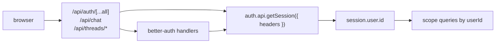

[better-auth](https://www.better-auth.com/) 是一个以 TypeScript 为先的身份验证库，端到端管理会话、用户表和 Cookie。它与 assistant-ui 的[自定义线程持久化](/docs/integrations/persistence/custom-adapter)天然搭配：用户和线程存储在同一个数据库中，而 `session.user.id` 可以直接用于你的 where 子句。

本页面介绍非云端方案。AssistantCloud 用户应参阅[云端授权](/docs/cloud/authorization)，了解 JWT 交换模式。

## 工作原理



有三个集成点：

1. 通过 `toNextJsHandler(auth)` 将**身份验证处理器**挂载到 `/api/auth/[...all]/route.ts`。
2. **API 路由**通过 `auth.api.getSession({ headers: await headers() })` 在服务端读取会话。
3. **身份验证后重新加载**使用 better-auth 的 React 客户端检测登录状态，并触发 `aui.threads.reload()`。

`session.user.id` 直接暴露在会话对象上，因此路由处理器可以据此限定查询范围。

## 设置

本指南假设你已经配置好 better-auth。如果还没有，请先按照[better-auth Next.js 指南](https://www.better-auth.com/docs/integrations/next) 操作；以下步骤从 `auth.ts` 导出 `betterAuth(...)` 实例之后开始。

<Steps>
<Step>

### 确认身份验证处理器已挂载

better-auth 自带全捕获处理器。请确保已完成接线：

```ts title="app/api/auth/[...all]/route.ts"
import { auth } from "@/auth";
import { toNextJsHandler } from "better-auth/next-js";

export const { GET, POST } = toNextJsHandler(auth);
```

否则，登录、登出和会话刷新请求将无处处理。

</Step>
<Step>

### 保护聊天路由

使用 `auth.api.getSession` 在服务端解析会话。它接受请求标头（其中包含会话 Cookie），并在未通过身份验证的请求中返回 `null`。

```ts title="app/api/chat/route.ts"
import { auth } from "@/auth";
import { headers } from "next/headers";
import { openai } from "@ai-sdk/openai";
import { streamText, convertToModelMessages } from "ai";
import type { UIMessage } from "ai";

export async function POST(req: Request) {
  const session = await auth.api.getSession({ headers: await headers() });
  if (!session) return new Response("Unauthorized", { status: 401 });

  const { messages }: { messages: UIMessage[] } = await req.json();
  const result = streamText({
    model: openai("gpt-5.6-luna"),
    messages: await convertToModelMessages(messages),
  });
  return result.toUIMessageStreamResponse();
}
```

App Router 路由处理器中的 `headers()` 来自 `next/headers`，会返回当前请求的标头。请始终 `await` 它。

</Step>
<Step>

### 按用户限定线程查询范围

如果使用[自定义线程持久化](/docs/integrations/persistence/custom-adapter)，每个端点都必须按 `session.user.id` 进行筛选。其模式与聊天路由相似：

```ts title="app/api/threads/route.ts"
import { auth } from "@/auth";
import { headers } from "next/headers";
import { db } from "@/db";
import { threads } from "@/db/schema";
import { eq, desc } from "drizzle-orm";

export async function GET() {
  const session = await auth.api.getSession({ headers: await headers() });
  if (!session) return new Response(null, { status: 401 });

  const rows = await db
    .select()
    .from(threads)
    .where(eq(threads.userId, session.user.id))
    .orderBy(desc(threads.updatedAt));

  return Response.json(rows);
}
```

如果 better-auth 的 schema 与线程表位于同一个数据库中，还可以将 `users.id` 作为外键，以支持级联删除。

</Step>
<Step>

### 设置 React 客户端

只创建一次客户端，并从共享模块中导入它，以便所有 Hook 共享状态：

```ts title="lib/auth-client.ts"
import { createAuthClient } from "better-auth/react";

export const authClient = createAuthClient();
```

</Step>
<Step>

### 异步身份验证后重新加载线程

React 客户端中的 `useSession` 会跟踪实时会话。在 `<AssistantRuntimeProvider>` 中加入一个小型 effect，在用户登录时重新加载线程列表：

```tsx title="app/components/ReloadOnAuth.tsx"
"use client";

import { useAui } from "@assistant-ui/react";
import { authClient } from "@/lib/auth-client";
import { useEffect } from "react";

export function ReloadOnAuth() {
  const aui = useAui();
  const { data: session, isPending } = authClient.useSession();
  useEffect(() => {
    if (!isPending && session) aui.threads.reload();
  }, [isPending, session?.user?.id]);
  return null;
}
```

将此组件挂载到 `<AssistantRuntimeProvider>` 子树中的任意位置（通常与 `MyProvider` 中运行时的 Provider 相邻）。`reload()` 会丢弃已被后续调用取代的进行中响应，因此可以在每次身份验证状态切换时安全调用。

</Step>
<Step>

### 运行并验证

登录后检查：

- 身份验证成功时，`/api/chat` 返回 `200`；未通过身份验证时返回 `401`。
- `/api/threads` 仅返回当前用户的线程。
- 第二个用户（使用无痕标签页）会看到不同的线程列表。
- `/api/auth/sign-in/*` 设置的会话 Cookie 是 `HttpOnly`，并会随同源 fetch 请求一起发送。

</Step>
</Steps>

## 注意事项

- **`session.user.id` 默认会填充。**`id` 字段来自 better-auth 管理的用户行，因此路由处理器无需任何回调配置即可限定查询范围。
- **基于 Cookie、同源。**浏览器 fetch 会自动包含会话 Cookie。如果将 API 拆分到其他主机，请设置 `credentials: "include"`，并在 API 上配置 CORS。
- **数据库对齐。**如果使用 Drizzle，并将 better-auth 的用户 schema 与线程 schema 放在同一个数据库中，外键可以确保删除操作保持一致。better-auth 的 CLI 会生成用户 schema；请添加引用 `user.id` 的 `threads` 表。
- **Edge 运行时。**当 better-auth 配置为使用兼容 Edge 的适配器时，`auth.api.getSession` 可同时运行在 Node 和 Edge 运行时中。
- **云端用户。**[AssistantCloud 的身份验证提供商集成](/docs/cloud/authorization)通过 JWT 交换支持 Clerk、Auth0、Supabase 和 Firebase。若要将 Cloud 与 better-auth 搭配使用，请采用[后端服务器令牌方案](/docs/cloud/authorization#backend-server-approach)：在服务端解析 `session.user.id`，以该 ID 作为 `userId` 生成 Assistant Cloud 令牌，并从令牌端点返回它。

## 相关内容

<Cards>
  <Card
    title="自定义线程持久化"
    description="本页面所构建的持久化方案；在 AssistantCloud 之外实现按用户区分的线程时必需。"
    href="/docs/integrations/persistence/custom-adapter"
  />
  <Card
    title="Auth.js (next-auth)"
    description="另一个常见的 Next.js 身份验证库。会话结构不同，但接线方式相同。"
    href="/docs/integrations/auth/next-auth"
  />
  <Card
    title="线程（概念）"
    description="完整的 RemoteThreadListAdapter 契约和身份验证后重新加载模式。"
    href="/docs/runtimes/concepts/threads"
  />
</Cards>
