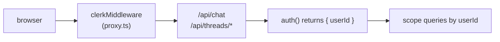

[Clerk](https://clerk.com/) 是一个托管式身份验证平台，可通过 `@clerk/nextjs` 与 Next.js 集成。本页面介绍如何在**不使用** AssistantCloud 的情况下使用它：基于中间件的路由保护、服务端 `auth()` 检查，以及在自定义线程列表中按用户进行数据隔离。

如果你使用 AssistantCloud，请改为参阅[云端授权](/docs/cloud/authorization)。Cloud 会为你处理 Clerk JWT 交换，并提供按工作区隔离的线程，无需编写数据库代码。

## 工作原理



Clerk 会在以下三个位置接入集成：

1. **中间件**在每个请求之前运行，并设置应用其余部分读取的身份验证上下文。
2. **API 路由**（`/api/chat`、`/api/threads/*`）从 `@clerk/nextjs/server` 调用 `await auth()`；当 `userId` 为 null 时返回 401，然后使用该 ID 限定数据库查询范围。
3. **身份验证后重新加载**使用 `@clerk/nextjs` 中的 `useUser`，以便用户登录后重新获取线程列表。

Clerk 的 `auth()` 会直接返回 `userId`，因此路由处理程序无需配置回调即可限定查询范围。

## 设置

本指南假设你已经在 Next.js 应用中配置好了 Clerk。如果还没有，请先按照 [Clerk Next.js 快速入门](https://clerk.com/docs/quickstarts/nextjs) 操作；下面的步骤从 `<ClerkProvider>` 包裹根布局且 `clerkMiddleware()` 已就绪之后开始。

<Steps>
<Step>

### 保护聊天路由

在 AI SDK 路由中添加 `auth()` 检查。在调用模型之前返回 401，以避免未通过身份验证的请求消耗提供商额度。

```ts title="app/api/chat/route.ts"
import { auth } from "@clerk/nextjs/server";
import { openai } from "@ai-sdk/openai";
import { streamText, convertToModelMessages } from "ai";
import type { UIMessage } from "ai";

export async function POST(req: Request) {
  const { userId } = await auth();
  if (!userId) return new Response("Unauthorized", { status: 401 });

  const { messages }: { messages: UIMessage[] } = await req.json();
  const result = streamText({
    model: openai("gpt-5.6-luna"),
    messages: await convertToModelMessages(messages),
  });
  return result.toUIMessageStreamResponse();
}
```

</Step>
<Step>

### 按用户限定线程查询范围

如果你还使用了[自定义线程持久化](/docs/integrations/persistence/custom-adapter)，每个线程列表端点都必须按 `userId` 进行筛选。如果不限定范围，任何已登录用户都可以列出所有人的线程。

```ts title="app/api/threads/route.ts"
import { auth } from "@clerk/nextjs/server";
import { db } from "@/db";
import { threads } from "@/db/schema";
import { eq, desc } from "drizzle-orm";

export async function GET() {
  const { userId } = await auth();
  if (!userId) return new Response(null, { status: 401 });

  const rows = await db
    .select()
    .from(threads)
    .where(eq(threads.userId, userId))
    .orderBy(desc(threads.updatedAt));

  return Response.json(rows);
}
```

对于按组织限定的线程（Clerk Orgs），从 `auth()` 中获取 `orgId`，并将其添加到 where 子句中。两者组合后即可构成稳定的工作区键：

```ts
import { and, eq } from "drizzle-orm";

const { userId, orgId } = await auth();
if (!userId) return new Response(null, { status: 401 });

const rows = await db
  .select()
  .from(threads)
  .where(
    orgId
      ? and(eq(threads.orgId, orgId), eq(threads.userId, userId))
      : eq(threads.userId, userId),
  );
```

</Step>
<Step>

### 异步身份验证后重新加载线程

`<MyProvider>` 的首次渲染可能发生在 Clerk 解析客户端用户之前。在 `<AssistantRuntimeProvider>` 中添加一个小型 effect，在用户加载完成后调用 `aui.threads.reload()`：

```tsx title="app/components/ReloadOnAuth.tsx"
"use client";

import { useAui } from "@assistant-ui/react";
import { useUser } from "@clerk/nextjs";
import { useEffect } from "react";

export function ReloadOnAuth() {
  const aui = useAui();
  const { isLoaded, isSignedIn, user } = useUser();
  useEffect(() => {
    if (isLoaded && isSignedIn) aui.threads.reload();
  }, [isLoaded, isSignedIn, user?.id]);
  return null;
}
```

将此组件挂载到 `<AssistantRuntimeProvider>` 子树中的任意位置（通常与 `MyProvider` 中运行时的 provider 放在一起）。`reload()` 会丢弃已被后续调用取代的进行中响应，因此可以在每次身份验证状态转换时调用它（登录、登出、切换组织）。

</Step>
<Step>

### 运行并验证

登录后检查：

- `/api/chat` 在通过身份验证时返回带流式响应的 `200`；未通过身份验证时返回 `401`。
- `/api/threads` 只返回当前用户的线程。
- 切换用户（使用隐身标签页或其他账户）后，应显示不同的线程列表。
- 在 Clerk 的 `<OrganizationSwitcher>` 中切换当前组织会触发重新加载（如果你已将 `orgId` 接入 where 子句）。

</Step>
</Steps>

## 注意事项

- **Cookie 会自动处理。** Clerk 的会话 Cookie 会随同源 fetch 请求一起发送；浏览器请求你自己的 API 路由时无需 `credentials: "include"`。
- **服务端上下文。** `@clerk/nextjs/server` 中的 `auth()` 可在任何 Next.js 服务端上下文中运行：服务端组件、路由处理程序和服务端操作。有关支持的使用场景，请参阅 Clerk 的 [`auth()` 参考](https://clerk.com/docs/references/nextjs/auth) 支持的使用场景。
- **Cloud 用户。** 如果你使用 AssistantCloud，建议采用 [Clerk JWT 模板集成](/docs/cloud/authorization)，而不是本页面中的模式。Cloud 会处理工作区分配，你无需自行构建线程持久化。
- **使用组织实现 B2B。** Clerk Orgs 可以很好地映射到多租户聊天：除了 `userId` 外，还应按 `orgId` 限定范围，展示 Clerk 的 `<OrganizationSwitcher>`（来自 `@clerk/nextjs`），并在组织变更时重新获取线程。

## 相关内容

<Cards>
  <Card
    title="自定义线程持久化"
    description="本页面所依赖的持久化方案；在 AssistantCloud 之外实现按用户划分的线程时必需。"
    href="/docs/integrations/persistence/custom-adapter"
  />
  <Card
    title="AssistantCloud 授权"
    description="由云端管理的替代方案：Clerk JWT 模板加工作区范围控制，无需数据库代码。"
    href="/docs/cloud/authorization"
  />
  <Card
    title="线程（概念）"
    description="完整的 RemoteThreadListAdapter 合约以及身份验证后重新加载模式。"
    href="/docs/runtimes/concepts/threads"
  />
</Cards>
