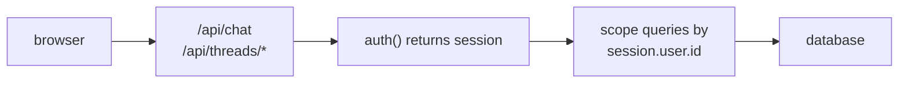

[Auth.js](https://authjs.dev/) NextAuth）是 Next.js 生态中占主导地位的开源身份验证库。本页面介绍如何在不使用 AssistantCloud 的情况下将其与 assistant-ui 结合使用：基于会话 Cookie 的身份验证、在 API 路由上进行服务端 `auth()` 检查，以及在自定义线程列表中按用户进行数据隔离。

如果你使用 AssistantCloud，请改为参阅[云授权](/docs/cloud)；云端会为你处理 JWT 交换。

## 工作原理



身份验证会影响集成的三个部分：

1. **API 路由**（`/api/chat`、`/api/threads/*`）在服务端调用 `auth()`，如果没有会话则返回 401，然后根据 `session.user.id` 限定数据库查询范围。
2. **`RemoteThreadListAdapter`** 不执行任何特定于身份验证的操作；Cookie 会随 `fetch` 调用自动传递（同源）。
3. **身份验证后重新加载**：如果会话在初始渲染完成后才解析，请调用 `aui.threads.reload()`，以便列表使用新的身份重新获取数据。

## 设置

本指南假设你已经配置了 Auth.js。如果还没有，请先参阅 [Auth.js 安装指南](https://authjs.dev/getting-started/installation?framework=Next.js) `auth.ts` 导出 `{ handlers, signIn, signOut, auth }` 之后开始。

<Steps>
<Step>

### 填充 `session.user.id`

默认情况下，Auth.js v5 **不会**在 `id` 上包含稳定的 `session.user`；只会公开 `email`、`name` 和 `image`。如果不执行此步骤，下面的作用域查询都会使用 `userId: undefined`，并且会静默匹配每一行。

将 `jwt` 和 `session` 回调添加到 Auth.js 配置中，让用户 ID 传递下去。对于 JWT 会话策略：

```ts title="auth.ts"
import NextAuth from "next-auth";

export const { handlers, signIn, signOut, auth } = NextAuth({
  providers: [/* your providers */],
  callbacks: {
    async jwt({ token, user }) {
      if (user) token.id = user.id;
      return token;
    },
    async session({ session, token }) {
      if (token.id) session.user.id = token.id as string;
      return session;
    },
  },
});
```

如果使用数据库会话策略，请将 `jwt`/`session` 回调对替换为单个 `session` 回调，从 `user` 参数复制：`session.user.id = user.id`。完整模式请参阅 [Auth.js：扩展会话](https://authjs.dev/guides/extending-the-session)

</Step>
<Step>

### 保护聊天路由

在现有的 AI SDK 路由中添加 `auth()` 检查。在调用模型前返回 401，避免未认证的流量消耗服务商额度。

```ts title="app/api/chat/route.ts"
import { auth } from "@/auth";
import { openai } from "@ai-sdk/openai";
import { streamText, convertToModelMessages } from "ai";
import type { UIMessage } from "ai";

export async function POST(req: Request) {
  const session = await auth();
  if (!session?.user) return new Response("Unauthorized", { status: 401 });

  const { messages }: { messages: UIMessage[] } = await req.json();
  const result = streamText({
    model: openai("gpt-5.6-luna"),
    messages: await convertToModelMessages(messages),
  });
  return result.toUIMessageStreamResponse();
}
```

</Step>
<Step>

### 按用户限定线程查询范围

如果还使用了[自定义线程持久化](/docs/integrations/persistence/custom-adapter，每个线程列表端点都必须按 `session.user.id` 进行筛选。如果不限定范围，任何已登录用户都可以列出所有人的线程。


```ts title="app/api/threads/route.ts"
import { auth } from "@/auth";
import { db } from "@/db";
import { threads } from "@/db/schema";
import { eq, desc } from "drizzle-orm";

export async function GET() {
  const session = await auth();
  if (!session?.user) return new Response(null, { status: 401 });

  const rows = await db
    .select()
    .from(threads)
    .where(eq(threads.userId, session.user.id))
    .orderBy(desc(threads.updatedAt));

  return Response.json(rows);
}
```

对 `POST`、`PATCH` 和 `DELETE` 处理器应用相同模式。执行变更前始终验证所有权。

</Step>
<Step>

### 异步认证后重新加载线程

`<MyProvider>` 的首次渲染可能会在客户端的 `auth()` 解析完成前执行。在线程列表为空之前，用户需要刷新页面。将一个小型 effect 添加到布局中，在会话解析完成后调用 `aui.threads.reload()`。

`useSession` 要求在组件树更高层存在 `<SessionProvider>`。只需在根布局的客户端子树外包裹一次：

```tsx title="app/providers.tsx"
"use client";

import { SessionProvider } from "next-auth/react";

export function Providers({ children }: { children: React.ReactNode }) {
  return <SessionProvider>{children}</SessionProvider>;
}
```

然后在助手运行时提供程序中挂载一个小型 effect：

```tsx title="app/components/ReloadOnAuth.tsx"
"use client";

import { useAui } from "@assistant-ui/react";
import { useSession } from "next-auth/react";
import { useEffect } from "react";

export function ReloadOnAuth() {
  const aui = useAui();
  const { status, data } = useSession();
  useEffect(() => {
    if (status === "authenticated") aui.threads.reload();
  }, [status, data?.user?.id]);
  return null;
}
```

`reload()` 会丢弃由后续调用取代的进行中响应，因此可以安全地在每次认证状态转换时调用它。

</Step>
<Step>

### 运行并验证

登录。检查以下内容：

- 已认证时，`/api/chat` 返回带有流式响应的 `200`；未认证时返回 `401`。
- `/api/threads` 只返回当前用户的线程。
- 第二个用户（隐身标签页或其他账户）会看到不同的线程列表。
- 退出登录后重新登录，不应哪怕短暂显示之前用户的线程；如果出现这种情况，说明 `ReloadOnAuth` 未挂载，或没有监听正确的会话字段。

</Step>
</Steps>

## 注意事项

- **同源 Cookie。** 当前端和 API 位于同一源时，浏览器会自动发送 Cookie。如果将 API 拆分到其他主机，请在每个 `credentials: "include"` 上设置 `fetch`，并在 API 上配置 CORS。
- **Edge 运行时。** `auth()` 仅在数据库适配器兼容 Edge 时，才能在 Edge 上下文中运行。如果你使用 Prisma、基于 `pg` 的 Drizzle，或其他不兼容 Edge 的适配器，同时又使用 Edge 路由处理器或 Next.js 16 之前版本的 middleware，请遵循 Auth.js 的[拆分配置模式](https://authjs.dev/guides/edge-compatibility): `auth.config.ts`，在其他位置实例化包含适配器的完整 `auth.ts`，并在 middleware 中仅导入由配置实例化的 `auth`。Next.js 16+ 会在 Node 上运行 `proxy.ts`，因此通常不需要此变通方案。
- **角色和组织。** 对于管理员可以查看组织下所有线程的 B2B SaaS，请将 `orgId` 添加到 `threads` 表中，通过 Auth.js 回调将用户角色存储在会话中，并据此控制 `list()` 的访问。模式保持不变；只是 `where` 子句会更加复杂。
- **OAuth 提供商。** 本页面与提供商无关。无论你是在 `auth()` 中配置 GitHub、Google、凭据还是 passkey 提供商，都可以使用相同的 `auth.ts` 模式。

## 相关内容

<Cards>
  <Card
    title="自定义线程持久化"
    description="本页面所采用的持久化方案；在 AssistantCloud 之外实现按用户划分的线程时所必需。"
    href="/docs/integrations/persistence/custom-adapter"
  />
  <Card
    title="AssistantCloud"
    description="托管式替代方案；云端负责与 Clerk、Auth0、Supabase、Firebase 进行 JWT 交换。"
    href="/docs/cloud"
  />
  <Card
    title="线程（概念）"
    description="完整的 RemoteThreadListAdapter 契约和身份验证后重新加载模式。"
    href="/docs/runtimes/concepts/threads"
  />
</Cards>
