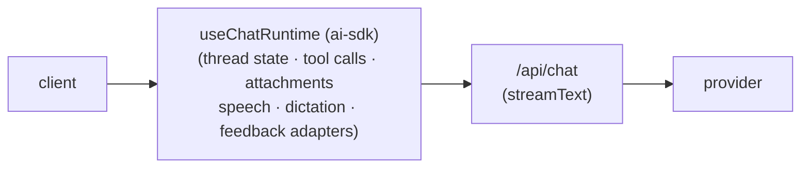

import { VercelIcon } from "@/components/icons/vercel";

[Vercel AI SDK](https://ai-sdk.dev/) 是最常与 assistant-ui 搭配使用的框架。完整的设置、附件、持久化、工具调用模式和版本说明都记录在 [runtimes/ai-sdk](/docs/runtimes/ai-sdk/overview) 下；本页面是 integrations 树中的入口，方便查找并了解架构背景。

<Callout type="info">
如果你来到这里是为了接入第一个聊天应用，请直接前往 [AI SDK v7 快速入门](/docs/runtimes/ai-sdk/v7)。本页面仅提供高层级指引。
</Callout>

## 它在架构中的位置

`@assistant-ui/ai-sdk`封装了 AI SDK 的 `useChat` hook，并将其作为 assistant-ui 运行时暴露出来。该运行时在客户端管理会话状态；你的 `/api/chat` 路由从 `streamText` 返回 UI 消息流。其他所有功能（工具、附件、可观测性、网关、自定义持久化）都构建在此基础之上。

## 选择版本

`ai` 支持四个版本。新项目应选择 **v7**；v6、v5 和 v4 版本面向迁移，以及尚未升级的现有应用提供文档。

<Cards>
  <Card
    icon={<VercelIcon width={20} height={20} />}
    title="AI SDK v7（当前版本）"
    description="需要 ai@^7 和 @ai-sdk/react@^4。异步 convertToModelMessages、工具 inputSchema、toUIMessageStreamResponse。"
    href="/docs/runtimes/ai-sdk/v7"
  />
  <Card
    icon={<VercelIcon width={20} height={20} />}
    title="AI SDK v6（旧版）"
    description="需要 ai@^6 和 @ai-sdk/react@^3。异步 convertToModelMessages、工具 inputSchema、toUIMessageStreamResponse。"
    href="/docs/runtimes/ai-sdk/v6-legacy"
  />
  <Card
    icon={<VercelIcon width={20} height={20} />}
    title="AI SDK v5（旧版）"
    description="需要 ai@^5 和 @ai-sdk/react@^2。同步 convertToModelMessages，过渡性 API。"
    href="/docs/runtimes/ai-sdk/v5-legacy"
  />
  <Card
    icon={<VercelIcon width={20} height={20} />}
    title="AI SDK v4（旧版）"
    description="最初基于 useChat 的路径。仅为迁移而维护。"
    href="/docs/runtimes/ai-sdk/v4-legacy"
  />
</Cards>

## 何时选择 AI SDK

对于使用 Next.js、Remix 或任何具有兼容 Node 的 API 路由的框架的新项目，AI SDK 是默认选择。在以下情况下可以选择它：

- 你希望以尽可能少的代码，从聊天 UI 直接连接到模型。
- 你将与 [Mastra](/docs/integrations/frameworks/mastra/overview) 之类的框架、[可观测性工具](/docs/integrations/observability/helicone)、[LLM 网关](/docs/integrations/gateways) 或[通过 MCP 使用的工具](/docs/tools/mcp)进行组合，而这些方案都以 AI SDK 路由为前提。
- 你希望获得原生支持的 `frontendTools`、附件、多步骤工具调用、令牌使用量元数据，以及通过 `withFormat` 持久化的历史记录。

如果你需要流式传输的代理状态（子图事件、生成式 UI 消息），请改为查看 [LangGraph](/docs/runtimes/langgraph/overview)。如果你使用的是其他具有协议结构的后端（A2A、AG-UI、OpenCode），请参阅[选择运行时](/docs/runtimes/pick-a-runtime)。

## 相关内容

<Cards>
  <Card
    icon={<VercelIcon width={20} height={20} />}
    title="AI SDK 运行时概览"
    description="完整的运行时文档和版本选择器。"
    href="/docs/runtimes/ai-sdk/overview"
  />
  <Card
    title="选择运行时"
    description="如果你不确定 AI SDK 是否适合自己的运行时，可参考此决策指南。"
    href="/docs/runtimes/pick-a-runtime"
  />
  <Card
    title="Mastra"
    description="本节中的另一个框架集成，通过 AI SDK 接入。"
    href="/docs/integrations/frameworks/mastra/overview"
  />
</Cards>
