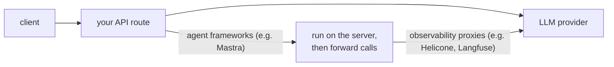

import { CloudflareIcon } from "@/components/icons/cloudflare";
import { HeliconeIcon } from "@/components/icons/helicone";
import { MastraIcon } from "@/components/icons/mastra";
import { LangfuseIcon } from "@/components/icons/langfuse";
import { LangChainIcon } from "@/components/icons/langchain";
import { McpIcon } from "@/components/icons/mcp";
import { VercelIcon } from "@/components/icons/vercel";

集成是使用第三方服务与 assistant-ui 配合工作的接线指南，同时也提供适配器插槽（持久化、附件）的标准实现方案。它们不同于[运行时](/docs/runtimes/pick-a-runtime)：运行时是连接 UI 与后端的 React 适配器包（`@assistant-ui/ai-sdk`、`@assistant-ui/react-langgraph`等）。集成默认你已经拥有一个可正常工作的运行时，并在其上添加额外能力。

## 集成位于架构中的位置

集成运行在服务器端。Mastra 等**智能体框架**会接管 API 路由。**网关**会替换上游服务提供商的 URL。**可观测性**会记录或追踪每次调用。**身份验证**会保护路由，并按用户划分数据范围。**持久化**和**附件**则是将聊天数据存储到默认内存路径之外的适配器实现方案。

## 框架

在 API 路由层与 assistant-ui 配合使用的框架集成。

<Cards>
  <Card
    icon={<VercelIcon width={20} height={20} />}
    title="Vercel AI SDK"
    description="官方标准适配器。完整设置位于运行时部分；此条目用于指向整体架构。"
    href="/docs/integrations/frameworks/ai-sdk"
  />
  <PlatformOnly platforms={["react"]}>
    <Card
      icon={<CloudflareIcon width={20} height={20} />}
      title="Cloudflare Agents"
      description="有状态的 Durable Object 智能体。通过 AI SDK 运行时接入，并使用 WebSocket 进行流式传输。"
      href="/docs/integrations/frameworks/cloudflare-agents"
    />
    <Card
      icon={<MastraIcon width={20} height={20} />}
      title="Mastra"
      description="TypeScript 智能体框架。通过 AI SDK 运行时路由，可使用全栈模式或独立服务器。"
      href="/docs/integrations/frameworks/mastra/overview"
    />
  </PlatformOnly>
</Cards>

## 工具

工具目录和协议有单独的 [工具](/docs/tools)部分。

<Cards>
  <Card
    icon={<McpIcon width={20} height={20} />}
    title="Model Context Protocol (MCP)"
    description="通过 AI SDK MCP 客户端，将任意 MCP 服务器连接为工具目录。"
    href="/docs/tools/mcp"
  />
</Cards>

## 网关

兼容 OpenAI 的代理，可提供目录路由、故障转移、BYOK 或自托管能力。

<Cards>
  <Card
    title="LLM 网关"
    description="OpenRouter、Portkey、LiteLLM Proxy。替换 baseURL，在多个服务提供商之间进行路由。"
    href="/docs/integrations/gateways"
  />
</Cards>

## 可观测性

记录、监控、追踪并评估 LLM 调用。这些服务可与任意运行时配合使用。

<Cards>
  <Card
    icon={<HeliconeIcon width={20} height={20} />}
    title="Helicone"
    description="可观测性代理。直接替换 baseURL，即可记录成本、延迟和提示词。"
    href="/docs/integrations/observability/helicone"
  />
  <Card
    icon={<LangfuseIcon width={20} height={20} />}
    title="Langfuse"
    description="基于 OpenTelemetry 的追踪和评估工具。开源且支持自托管。"
    href="/docs/integrations/observability/langfuse"
  />
  <Card
    icon={<LangChainIcon width={20} height={20} className="text-[#7FC8FF]" />}
    title="LangSmith"
    description="通过 wrapAISDK 实现 LangChain 生态追踪，并包含数据集和评估功能。"
    href="/docs/integrations/observability/langsmith"
  />
</Cards>

<PlatformOnly platforms={["react"]}>

## 身份验证

保护聊天路由，并将会话线程数据限定给已登录用户。这些页面介绍的是**非云端**路径；如果数据库由你自行管理，请与[自定义会话线程持久化](/docs/integrations/persistence/custom-adapter)配合使用。

<Cards>
  <Card
    title="Clerk"
    description="通过 Next.js 中间件提供托管式身份验证。auth() 返回 userId；Clerk Orgs 可映射到多租户聊天。"
    href="/docs/integrations/auth/clerk"
  />
  <Card
    title="better-auth"
    description="以 TypeScript 为优先，负责管理用户表和会话。session.user.id 默认会被填充。"
    href="/docs/integrations/auth/better-auth"
  />
  <Card
    title="Auth.js (next-auth)"
    description="开源的 Next.js 标准方案。需要使用 jwt/session 回调来填充 session.user.id。"
    href="/docs/integrations/auth/next-auth"
  />
</Cards>

对于 AssistantCloud 用户，[云端授权](/docs/cloud/authorization)可为 Clerk、Auth0、Supabase 和 Firebase 处理 JWT 交换，无需编写数据库代码。

</PlatformOnly>

## 持久化

将会话线程和消息存储在 AssistantCloud 之外。

<Cards>
  <Card
    title="自定义会话线程持久化"
    description="完整示例：Postgres + Drizzle、RemoteThreadListAdapter，以及带有 withFormat 的 ThreadHistoryAdapter。"
    href="/docs/integrations/persistence/custom-adapter"
  />
</Cards>

## 附件

将聊天附件上传到对象存储，而不是以内联数据 URL 的形式嵌入。

<Cards>
  <Card
    title="自定义附件上传"
    description="使用预签名 URL 的生产级 AttachmentAdapter。包含 S3/R2、Vercel Blob 和 Uploadthing 标签页。"
    href="/docs/integrations/attachments/custom-adapter"
  />
</Cards>

## 没有找到你的服务？

assistant-ui 不会为每个工具都提供指南，但大多数服务都符合以下两种模式之一：

- **通过你的 AI SDK 处理器进行路由**（智能体框架、可观测性代理、网关）：使用服务自身的 SDK，参考 [Mastra 全栈](/docs/integrations/frameworks/mastra/full-stack)或 [Helicone 代理](/docs/integrations/observability/helicone)模式进行适配。
- **完全替换运行时**（自定义后端）：请参阅[自定义后端](/docs/runtimes/custom/overview)。

如果你构建了有用的内容，可以[提交 issue](https://discord.gg/S9dwgCNEFs); [Discord](https://github.com/assistant-ui/assistant-ui/issues) 中发布；文档欢迎社区贡献。

## 相关内容

<Cards>
  <Card
    title="选择运行时"
    description="在添加集成之前，选择与你的后端匹配的 React 适配器。"
    href="/docs/runtimes/pick-a-runtime"
  />
  <Card
    title="运行时概念"
    description="涵盖所有运行时的架构、适配器、会话线程和稳定性。"
    href="/docs/runtimes/concepts/architecture"
  />
</Cards>
