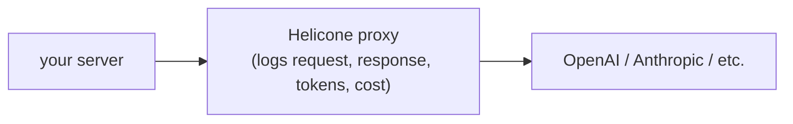

import { VercelIcon } from "@/components/icons/vercel";

[Helicone](https://www.helicone.ai/) 是一个 LLM 可观测性代理。将 provider 客户端指向 Helicone 的 URL，添加认证请求头，即可记录每个请求和响应，以及成本、延迟和提示词级别的差异。

无论使用哪种 assistant-ui 运行时，Helicone 都与之无关。它位于服务端的 LLM 客户端层（OpenAI SDK、AI SDK provider 或任何基于 HTTP 的 provider 客户端），而不是 assistant-ui 客户端运行时层。因此，它可以与任何后端搭配使用：AI SDK、LangGraph、Mastra 或自定义后端。

## 工作原理



调用会先经过 Helicone 的边缘节点，然后再到达上游 provider。该代理是透明的：响应结构和流式传输行为都不会改变，只是额外提供了一个包含所有调用的仪表板。

## 设置

<Steps>
<Step>

### 获取 Helicone API 密钥

在 [helicone.ai](https://www.helicone.ai/) 注册，然后从仪表板复制密钥。将其与 provider 密钥一起添加到环境变量中：

```sh title=".env.local"
HELICONE_API_KEY=sk-helicone-...
OPENAI_API_KEY=sk-...
```

</Step>
<Step>

### 将 provider 客户端指向代理

将 provider 的 `baseURL` 替换为 Helicone 的代理 URL，并添加 `Helicone-Auth` 请求头。

<Tabs items={["AI SDK", "OpenAI SDK"]}>
<Tab value="AI SDK">

```ts title="app/api/chat/route.ts"
import { createOpenAI } from "@ai-sdk/openai";
import { streamText, convertToModelMessages } from "ai";
import type { UIMessage } from "ai";

const openai = createOpenAI({
  baseURL: "https://oai.helicone.ai/v1",
  headers: {
    "Helicone-Auth": `Bearer ${process.env.HELICONE_API_KEY}`,
  },
});

export async function POST(req: Request) {
  const { messages }: { messages: UIMessage[] } = await req.json();
  const result = streamText({
    model: openai("gpt-5.6-luna"),
    messages: await convertToModelMessages(messages),
  });
  return result.toUIMessageStreamResponse();
}
```

</Tab>
<Tab value="OpenAI SDK">

```ts title="app/api/chat/route.ts"
import OpenAI from "openai";

const openai = new OpenAI({
  baseURL: "https://oai.helicone.ai/v1",
  defaultHeaders: {
    "Helicone-Auth": `Bearer ${process.env.HELICONE_API_KEY}`,
  },
});

export async function POST(req: Request) {
  const { messages } = await req.json();
  const stream = await openai.chat.completions.create({
    model: "gpt-5.6-luna",
    messages,
    stream: true,
  });
  return new Response(stream.toReadableStream());
}
```

如果直接调用 OpenAI SDK，还需要将响应适配为 `useChatRuntime` 能够理解的流。上方的 AI SDK 标签页会为你处理这一点。

</Tab>
</Tabs>

</Step>
<Step>

### 在仪表板中验证

通过助手发送一条消息。几秒钟后，该调用应会出现在 Helicone 仪表板中，其中包含 token 数量、延迟以及完整的提示词和补全文本。

如果没有显示，请在网络面板中检查请求。主机应为 `oai.helicone.ai`，而不是 `api.openai.com`；请求应携带 `Helicone-Auth`（上文显式添加）和 `Authorization`（OpenAI 客户端根据 `OPENAI_API_KEY` 自动添加）。

</Step>
</Steps>

## 注意事项

- **仅限服务端。** 切勿在客户端代码中设置 Helicone 密钥；代理会接收你的 provider 密钥，因此必须在服务端运行。
- **其他 provider。** 对于 Anthropic、Gemini 及其他 provider，请替换基础 URL：参阅 Helicone 的 [provider 文档](https://docs.helicone.ai/getting-started/integration-method/gateway).
- **自定义元数据。** 可以在每个请求中添加 `Helicone-User-Id`、`Helicone-Property-*` 或会话请求头，以便在仪表板中进行筛选和聚合。请求头详见[请求头参考](https://docs.helicone.ai/helicone-headers/header-directory).
- **流式传输、工具和附件**均可正常工作，因为 Helicone 会以透明方式封装底层 provider。

## 相关内容

<Cards>
  <Card
    title="选择运行时"
    description="选择一个后端集成；Helicone 可以与其中任何一个搭配使用。"
    href="/docs/runtimes/pick-a-runtime"
  />
  <Card
    icon={<VercelIcon width={20} height={20} />}
    title="AI SDK 运行时"
    description="最常见的搭配方式：通过 Helicone 代理转发 AI SDK 路由处理程序。"
    href="/docs/runtimes/ai-sdk/v7"
  />
</Cards>
