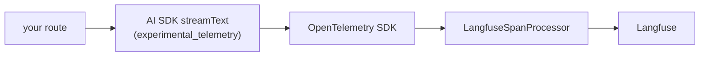

import { HeliconeIcon } from "@/components/icons/helicone";
import { LangChainIcon } from "@/components/icons/langchain";
import { VercelIcon } from "@/components/icons/vercel";

[Langfuse](https://langfuse.com/) 是一个开源 LLM 可观测性平台。它会为每个请求提供层级化链路追踪（规划器 → 工具调用 → 最终 LLM 步骤）、提示词级分析、数据集以及 LLM-as-judge 评估。支持自行托管，并原生支持 OpenTelemetry。

如果你希望在单次交互中查看助手的完整调用树，可以选择 Langfuse。它与 [Helicone](/docs/integrations/observability/helicone) 互为补充：Helicone 代理并记录单个提供商调用；许多团队会同时使用两者，由 Helicone 捕获请求日志，由 Langfuse 捕获链路追踪。

## 工作原理



启用遥测后，AI SDK 会发出 OpenTelemetry span，Langfuse 会订阅这些 span。无需代理，也无需封装；SDK 发出 span，Langfuse 负责将其呈现出来。

## 设置

<Steps>
<Step>

### 获取 Langfuse 凭据

在 [langfuse.com](https://langfuse.com/) 注册（或自行托管）并创建项目。从项目设置中复制公钥和密钥。

```sh title=".env.local"
LANGFUSE_PUBLIC_KEY=pk-lf-...
LANGFUSE_SECRET_KEY=sk-lf-...
LANGFUSE_BASE_URL=https://cloud.langfuse.com
```

基础 URL 根据区域而有所不同：`https://cloud.langfuse.com`（EU）、`https://us.cloud.langfuse.com`，或者你自行托管的 URL。

</Step>
<Step>

### 安装 OTel 和 Langfuse 软件包

<InstallCommand npm={["@langfuse/tracing", "@langfuse/otel", "@opentelemetry/sdk-node"]} />

`@langfuse/tracing` 提供用于使用用户、会话和链路名称标记链路的辅助函数。`@langfuse/otel` 提供 span 处理器。`@opentelemetry/sdk-node` 是 OTel SDK。

</Step>
<Step>

### 在启动时初始化一次 OpenTelemetry

创建一个用于启动 OTel SDK 并注册 Langfuse span 处理器的 instrumentation 文件。在 Next.js 中，将其放在`instrumentation.ts`中，使其在每个服务器进程中运行一次。在模块作用域导出该处理器，以便其他代码可以对其调用`forceFlush()`。

```ts title="instrumentation.ts"
import { NodeSDK } from "@opentelemetry/sdk-node";
import { LangfuseSpanProcessor } from "@langfuse/otel";

export const langfuseSpanProcessor = new LangfuseSpanProcessor();

export async function register() {
  if (process.env.NEXT_RUNTIME !== "nodejs") return;

  const sdk = new NodeSDK({
    spanProcessors: [langfuseSpanProcessor],
  });
  sdk.start();
}
```

`NEXT_RUNTIME !== "nodejs"`会跳过 OTel 不运行的 edge 运行时。在 Next.js 14 或更早版本中，还需要在`next.config.mjs`中设置`experimental.instrumentationHook = true`：

```js title="next.config.mjs"
const nextConfig = {
  experimental: { instrumentationHook: true },
};
export default nextConfig;
```

</Step>
<Step>

### 使用`propagateAttributes`封装 AI SDK 调用

通过`experimental_telemetry: { isEnabled: true }`启用遥测，并从`@langfuse/tracing`中使用`propagateAttributes`封装每次调用，以设置链路名称，并按用户 / 会话对链路进行分组。

```ts title="app/api/chat/route.ts"
import { openai } from "@ai-sdk/openai";
import { streamText, convertToModelMessages } from "ai";
import type { UIMessage } from "ai";
import { propagateAttributes } from "@langfuse/tracing";

export async function POST(req: Request) {
  const { messages }: { messages: UIMessage[] } = await req.json();

  const userId = "<resolve from your session>";
  const sessionId = "<resolve from your thread state>";

  const result = await propagateAttributes(
    { traceName: "chat-completion", userId, sessionId },
    async () =>
      streamText({
        model: openai("gpt-5.6-luna"),
        messages: await convertToModelMessages(messages),
        experimental_telemetry: { isEnabled: true },
      }),
  );

  return result.toUIMessageStreamResponse();
}
```

`traceName`会成为 Langfuse 控制面板中的链路标签。`userId`和`sessionId`是 Langfuse 的标准过滤维度；请传入身份验证和线程状态中的真实值，而不是字面字符串。

</Step>
<Step>

### 运行并验证

通过你的助手发送一条消息。几秒钟内，Langfuse 控制面板中应该会出现一条链路，其中包含：

- 由`traceName`设置的链路名称。
- 每次 LLM 调用和工具调用对应的子 span。
- 每个 span 中的完整提示词、补全内容和令牌用量。
- 你传入的元数据（用户、会话、自定义键），可用作过滤条件。

如果没有任何内容出现，请检查服务器日志中的 OTel 错误，并确认`LANGFUSE_PUBLIC_KEY` / `LANGFUSE_SECRET_KEY`已加载到处理请求的运行时中。

</Step>
</Steps>

## 注意事项

- **无服务器刷新。** 在无服务器平台上，函数可能会在 OTel 刷新缓冲区之前退出，导致链路丢失。导入上一步导出的处理器，并在响应前调用`await langfuseSpanProcessor.forceFlush()`，或者使用运行时的`waitUntil` API。Langfuse 文档介绍了针对不同部署方式的具体模式。
- **自行托管。** 将`LANGFUSE_BASE_URL`指向你的自行托管实例。其他集成方式完全相同。
- **采样。** 对于高流量应用，在`NodeSDK`上配置 OTel 采样，以保持成本可预测。Langfuse 也可以在项目级别进行采样。
- **与 Helicone 配合使用。** 两者互为补充：Helicone 代理并记录每个请求；Langfuse 追踪助手。许多团队会同时使用两者。

## 相关内容

<Cards>
  <Card
    icon={<LangChainIcon width={20} height={20} className="text-[#7FC8FF]" />}
    title="LangSmith"
    description="LangChain 生态系统的替代方案，使用 wrapAISDK 而不是 OpenTelemetry。"
    href="/docs/integrations/observability/langsmith"
  />
  <Card
    icon={<HeliconeIcon width={20} height={20} />}
    title="Helicone"
    description="基于代理的请求日志记录，每次调用都提供成本、延迟和提示词差异。"
    href="/docs/integrations/observability/helicone"
  />
  <Card
    icon={<VercelIcon width={20} height={20} />}
    title="AI SDK 运行时"
    description="发出 Langfuse 所使用遥测数据的运行时。"
    href="/docs/runtimes/ai-sdk/v7"
  />
</Cards>
