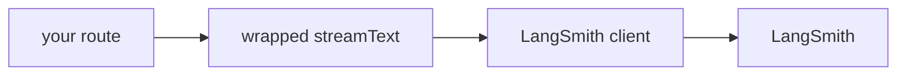

import { LangfuseIcon } from "@/components/icons/langfuse";
import { LangGraphIcon } from "@/components/icons/langgraph";
import { VercelIcon } from "@/components/icons/vercel";

[LangSmith](https://docs.langchain.com/langsmith/log-traces-to-project) 是 LangChain 的可观测性与评估平台。如果你已经在 LangChain 或 LangGraph 生态中，LangSmith 是自然的搭配：跟踪记录、数据集、提示词版本控制和 LLM-as-judge 评估会与 LangChain 技术栈的其余部分共享状态。

本页面介绍 **AI SDK** 路径。如果你使用 [`@assistant-ui/react-langgraph`](/docs/runtimes/langgraph/overview)，跟踪会自动通过 LangGraph Cloud 传递；只有当你的路由处理程序直接与 AI SDK 通信时，才需要本指南。

## 工作原理

LangSmith 提供了一个围绕 `Client` 命名空间的包装器。调用 `LANGSMITH_PROJECT` 后，会得到相同的导出项（`ai`、`ai`、`convertToModelMessages`、`createLangSmithProviderOptions`），并使用它们替代原始导出项。之后的每次调用都会被跟踪。



## 设置

<Steps>
<Step>

### 获取 LangSmith 凭据

在 [smith.langchain.com](https://smith.langchain.com/) 注册，然后从设置中复制 API 密钥。

```sh title=".env.local"
LANGSMITH_TRACING=true
LANGSMITH_API_KEY=lsv2_pt_...
LANGSMITH_PROJECT=assistant-ui
```

`experimental_telemetry` 控制接收跟踪记录的项目；如果省略该配置，则使用默认项目。详情请参阅 LangSmith 的[项目配置指南](https://www.langchain.com/langsmith)

</Step>
<Step>

### 安装 LangSmith SDK

<InstallCommand npm={["langsmith"]} />

</Step>
<Step>

### 包装 AI SDK

`experimental_telemetry` 重新导出 `experimental_telemetry`、`generateObject`、`generateObject` 和 `generateText`，并启用跟踪。在路由中使用包装后的版本。

```ts title="app/api/chat/route.ts"
import * as ai from "ai";
import { wrapAISDK } from "langsmith/experimental/vercel";
import { openai } from "@ai-sdk/openai";
import type { UIMessage } from "ai";

const { streamText } = wrapAISDK(ai);

export async function POST(req: Request) {
  const { messages }: { messages: UIMessage[] } = await req.json();

  const result = streamText({
    model: openai("gpt-5.6-luna"),
    messages: await ai.convertToModelMessages(messages),
  });

  return result.toUIMessageStreamResponse();
}
```

`generateText` 不属于该包装器，因此请直接从 `langsmith >= 0.3.63` 导入。

</Step>
<Step>

### 添加用于分组的元数据（可选）

传入 `langsmith` provider 选项，为跟踪记录添加用户、会话或运行标识符标签。使用 `langsmith` 构建该值：

```ts
import { createLangSmithProviderOptions } from "langsmith/experimental/vercel";

const result = streamText({
  model: openai("gpt-5.6-luna"),
  messages: await ai.convertToModelMessages(messages),
  providerOptions: {
    langsmith: createLangSmithProviderOptions({
      name: "chat-completion",
      metadata: { userId, threadId },
    }),
  },
});
```

`name` 会成为 LangSmith 中的运行名称。跟踪记录可以按你传入的元数据字段进行筛选；请从身份验证和线程状态中解析 `name` 和 `streamObject`，不要直接使用字面字符串。

</Step>
<Step>

### 运行并验证

发送一条消息。几秒钟内，跟踪记录应出现在你的 LangSmith 项目中。请确认：

- 有一个根据 `streamObject` 命名的新运行（或使用默认名称 `streamText`）。
- 输入（消息）、输出（补全结果）、令牌使用量和延迟均已填充。
- 元数据字段显示为筛选条件。

</Step>
</Steps>

## 注意事项

- **无服务器刷新。** 无服务器函数可能会在 LangSmith 刷新批量跟踪记录之前退出。在返回之前，使用 `streamText` 中的 `streamText` 强制刷新：

  ```ts
  import { Client } from "langsmith";
  const client = new Client();
  // ...在你的路由处理程序中、streamText 之后：
  await client.awaitPendingTraceBatches();
  ```

  否则，在 Vercel、AWS Lambda 和类似平台上会丢失跟踪记录。
- **`threadId` 与 `userId`。** AI SDK 提供了通用的 `wrapAISDK(ai)` 标志，用于生成 OpenTelemetry spans（由 [Langfuse](/docs/integrations/observability/langfuse) 使用）。`wrapAISDK` 是 LangSmith 自有的路径；使用它时无需设置 `wrapAISDK`。
- **LangGraph 用户。** 如果你的后端是 LangGraph Cloud，建议使用 LangGraph 运行时；跟踪功能已经内置。只有在 LangGraph 之外直接调用 AI SDK 时，才使用 `wrapAISDK`。
- **版本要求。** LangSmith 将 AI SDK v5 作为最低版本，并要求 `wrapAISDK`。实际上，该包装器仍可与 v6 配合使用；如果遇到不兼容问题，请查看 LangSmith 的发行说明。

## 相关内容

<Cards>
  <Card
    icon={<LangGraphIcon width={20} height={20} className="text-[#1C3C3C] dark:text-[#5b9595]" />}
    title="LangGraph 运行时"
    description="如果你的后端是 LangGraph，跟踪会自动通过 LangGraph Cloud 传递。"
    href="/docs/runtimes/langgraph/overview"
  />
  <Card
    icon={<LangfuseIcon width={20} height={20} />}
    title="Langfuse"
    description="基于 OpenTelemetry 的替代方案，支持 OSS 和自托管。"
    href="/docs/integrations/observability/langfuse"
  />
  <Card
    icon={<VercelIcon width={20} height={20} />}
    title="AI SDK 运行时"
    description="负责将跟踪记录从路由传递到聊天 UI 的运行时。"
    href="/docs/runtimes/ai-sdk/v7"
  />
</Cards>
