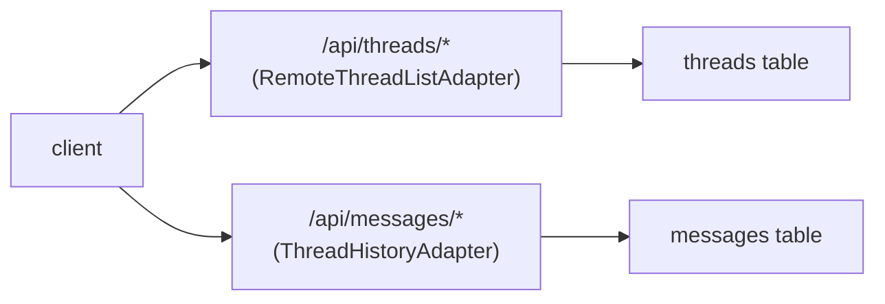

当 [AssistantCloud](/docs/cloud) 不适用时（例如需要自托管、满足合规要求，或希望将线程与现有应用数据存储在一起），可以使用你自己的数据库为多线程运行时提供后端支持。本页是一个完整示例，涵盖使用 Postgres + Drizzle 时的架构、路由处理器和适配器连接方式。对于任何 SQL 或文档存储，结构都是相同的。

有关适配器契约的概览，请参阅 [线程](/docs/runtimes/concepts/threads)。本页重点介绍存储层，以及 `withFormat` 如何往返处理 AI SDK 消息。

## 前置条件

下面的路由处理器会从 `auth` 导入 `@/auth`，并从 `db` 导入 `@/db`。本指南假设你已具备：

- 一个可正常运行的 [Drizzle 配置](https://orm.drizzle.team/docs/get-started-postgresql) `db/index.ts`，并导出一个 `db` 实例。
- 一个身份验证方案，其中包含服务端 `auth()` 辅助函数，并暴露 `session.user.id`。有关标准配置（包括填充 `session.user.id` 的回调），请参阅 [Auth.js (next-auth)](/docs/integrations/auth/next-auth)。

如果你使用的是自定义身份验证方案，请将 `auth()` 调用替换为你的技术栈用于解析当前用户的相应方法。

## 工作原理



两个适配器，两张表：

- **`RemoteThreadListAdapter`** 负责线程*元数据*：列出、创建、重命名、归档和删除。
- **`ThreadHistoryAdapter`** 负责每个线程的*消息*。`withFormat` 变体由 `useChatRuntime` 要求使用，并将 AI SDK `UIMessage` 与固定的行结构 `{ id, parent_id, format, content }` 互相转换。

## Schema

```ts title="db/schema.ts"
import { pgTable, text, timestamp, jsonb, index } from "drizzle-orm/pg-core";

export const threads = pgTable(
  "threads",
  {
    id: text("id").primaryKey(),
    userId: text("user_id").notNull(),
    title: text("title"),
    status: text("status", { enum: ["regular", "archived"] })
      .notNull()
      .default("regular"),
    custom: jsonb("custom").$type<Record<string, unknown>>(),
    createdAt: timestamp("created_at").notNull().defaultNow(),
    updatedAt: timestamp("updated_at").notNull().defaultNow(),
  },
  (t) => [index("threads_user_idx").on(t.userId)],
);

export const messages = pgTable(
  "messages",
  {
    id: text("id").primaryKey(),
    threadId: text("thread_id")
      .notNull()
      .references(() => threads.id, { onDelete: "cascade" }),
    parentId: text("parent_id"),
    format: text("format").notNull(),
    content: jsonb("content").notNull(),
    createdAt: timestamp("created_at").notNull().defaultNow(),
  },
  (t) => [index("messages_thread_idx").on(t.threadId)],
);
```

四个消息列（`id`、`parent_id`、`format`、`content`）是 `withFormat` 写入所遵循的契约。`format` 记录对该行进行编码的适配器，从而允许多个运行时共用一张表；`useChatRuntime` 会根据 `fmt.format` 设置该值。

<Callout type="warn">
  `content` 不是任意 JSON。它必须是当前格式适配器通过 `fmt.encode(item)` 生成的负载，并通过 `fmt.decode` 读取；下方的路由处理程序只是透传，完全不会检查其中的内容。对于 `useChatRuntime`（AI SDK v6），有效的存储行如下所示：

  ```json
  {
    "id": "msg_abc",
    "parent_id": null,
    "format": "ai-sdk/v6",
    "content": { "role": "user", "parts": [{ "type": "text", "text": "hello" }] }
  }
  ```

  满足列类型但包含不同结构（例如 `{ "foo": "bar" }`）的行可以成功写入，但在重新加载历史记录时会失败。请通过适配器写入测试数据，不要手动构造 `content`。
</Callout>

## 设置

<Steps>
<Step>

### 安装依赖

<InstallCommand npm={["drizzle-orm", "postgres", "drizzle-kit"]} />

配置 Drizzle 并运行迁移。有关完整设置，请参阅 [Drizzle 快速入门](https://orm.drizzle.team/docs/get-started-postgresql)

</Step>
<Step>

### 构建线程列表端点

`RemoteThreadListAdapter` 中的每个方法都对应一个路由。始终使用会话中的 `userId` 进行限定，确保用户只能看到自己的线程。

```ts title="app/api/threads/route.ts"
import { db } from "@/db";
import { threads } from "@/db/schema";
import { auth } from "@/auth";
import { and, desc, eq } from "drizzle-orm";
import { generateId } from "ai";

export async function GET() {
  const session = await auth();
  if (!session?.user) return new Response(null, { status: 401 });

  const rows = await db
    .select()
    .from(threads)
    .where(eq(threads.userId, session.user.id))
    .orderBy(desc(threads.updatedAt));

  return Response.json(rows);
}

export async function POST(req: Request) {
  const session = await auth();
  if (!session?.user) return new Response(null, { status: 401 });

  const id = generateId();
  await db.insert(threads).values({ id, userId: session.user.id });
  return Response.json({ id });
}
```

在 `app/api/threads/[id]/route.ts` 下以相同方式实现每个线程对应的路由。`PATCH` 会更新 `title` 或 `status`（由 `rename`、`archive`、`unarchive` 使用）；`DELETE` 会删除线程；`GET` 会返回单个线程（由 `fetch` 使用）。务必在每个处理程序中检查 `userId`：

```ts title="app/api/threads/[id]/route.ts"
import { db } from "@/db";
import { threads } from "@/db/schema";
import { auth } from "@/auth";
import { and, eq } from "drizzle-orm";

export async function PATCH(
  req: Request,
  { params }: { params: Promise<{ id: string }> },
) {
  const { id } = await params;
  const session = await auth();
  if (!session?.user) return new Response(null, { status: 401 });

  const patch = (await req.json()) as { title?: string; status?: "regular" | "archived" };
  await db
    .update(threads)
    .set({ ...patch, updatedAt: new Date() })
    .where(and(eq(threads.id, id), eq(threads.userId, session.user.id)));

  return new Response(null, { status: 204 });
}
```

一个调用模型并传入前几条消息、然后返回 `{ title }` 的 `POST /api/threads/[id]/title` 端点即可完成整个集合。其结构与其他端点一致；将其视为 `streamText` 加上 JSON 响应。

</Step>
<Step>

### 构建消息端点

两个路由：列出线程中的消息，以及追加一条消息。两者都会先检查线程所有权，然后才访问消息表。

```ts title="app/api/threads/[id]/messages/route.ts"
import { db } from "@/db";
import { threads, messages } from "@/db/schema";
import { auth } from "@/auth";
import { and, asc, eq } from "drizzle-orm";

export async function GET(
  _req: Request,
  { params }: { params: Promise<{ id: string }> },
) {
  const { id } = await params;
  const session = await auth();
  if (!session?.user) return new Response(null, { status: 401 });

  const [thread] = await db
    .select()
    .from(threads)
    .where(and(eq(threads.id, id), eq(threads.userId, session.user.id)));
  if (!thread) return new Response(null, { status: 404 });

  const rows = await db
    .select()
    .from(messages)
    .where(eq(messages.threadId, id))
    .orderBy(asc(messages.createdAt));

  return Response.json(rows);
}

export async function POST(
  req: Request,
  { params }: { params: Promise<{ id: string }> },
) {
  const { id } = await params;
  const session = await auth();
  if (!session?.user) return new Response(null, { status: 401 });

  const body = (await req.json()) as {
    id: string;
    parent_id: string | null;
    format: string;
    content: Record<string, unknown>;
  };

  await db.insert(messages).values({
    id: body.id,
    threadId: id,
    parentId: body.parent_id,
    format: body.format,
    content: body.content,
  });

  return new Response(null, { status: 204 });
}
```

</Step>
<Step>

### 实现 `RemoteThreadListAdapter`

适配器会调用你的端点。`unstable_useAdapters` 会将按线程划分的历史记录适配器注入 `RemoteThreadList` 存储条目；当省略 `unstable_Provider` 时，也会将其注入 `useRemoteThreadListRuntime`。`unstable_Provider` 是该运行时可选的 React 界面。在 `RemoteThreadList` 存储条目上，使用 `withKey(id, …)` 作为线程工厂的键，以便在可见线程发生变化时重新加载历史记录。

<PlatformTabs>
<Tab value="React">

```tsx title="app/runtime/thread-adapter.tsx"
"use client";

import {
  RuntimeAdapterProvider,
  useAui,
  type RemoteThreadListAdapter,
  type ThreadHistoryAdapter,
} from "@assistant-ui/react";
import { createAssistantStream } from "assistant-stream";
import { useMemo } from "react";

function useThreadListAdapters() {
  const aui = useAui();
  const history = useMemo<ThreadHistoryAdapter>(
    () => ({
      async load() {
        return { messages: [] };
      },
      async append() {},
      withFormat: (fmt) => ({
        async load() {
          const { remoteId } = aui.threadListItem.getState();
          if (!remoteId) return { messages: [] };
          const rows = await fetch(
            `/api/threads/${remoteId}/messages`,
          ).then((r) => r.json());
          return {
            messages: rows.map((row: any) =>
              fmt.decode({
                id: row.id,
                parent_id: row.parent_id,
                format: row.format,
                content: row.content,
              }),
            ),
          };
        },
        async append(item) {
          const { remoteId } = await aui.threadListItem.initialize();
          await fetch(`/api/threads/${remoteId}/messages`, {
            method: "POST",
            body: JSON.stringify({
              id: fmt.getId(item.message),
              parent_id: item.parentId,
              format: fmt.format,
              content: fmt.encode(item),
            }),
          });
        },
      }),
    }),
    [aui],
  );
  return useMemo(() => ({ history }), [history]);
}

export const threadListAdapter: RemoteThreadListAdapter = {
  async list() {
    const rows = await fetch("/api/threads").then((r) => r.json());
    return {
      threads: rows.map((t: any) => ({
        status: t.status,
        remoteId: t.id,
        title: t.title ?? undefined,
      })),
    };
  },
  async initialize() {
    const { id } = await fetch("/api/threads", { method: "POST" }).then((r) =>
      r.json(),
    );
    return { remoteId: id };
  },
  async rename(remoteId, title) {
    await fetch(`/api/threads/${remoteId}`, {
      method: "PATCH",
      body: JSON.stringify({ title }),
    });
  },
  async archive(remoteId) {
    await fetch(`/api/threads/${remoteId}`, {
      method: "PATCH",
      body: JSON.stringify({ status: "archived" }),
    });
  },
  async unarchive(remoteId) {
    await fetch(`/api/threads/${remoteId}`, {
      method: "PATCH",
      body: JSON.stringify({ status: "regular" }),
    });
  },
  async delete(remoteId) {
    await fetch(`/api/threads/${remoteId}`, { method: "DELETE" });
  },
  async fetch(remoteId) {
    const t = await fetch(`/api/threads/${remoteId}`).then((r) => r.json());
    return { status: t.status, remoteId: t.id, title: t.title };
  },
  async generateTitle(remoteId, messages) {
    return createAssistantStream(async (controller) => {
      const { title } = await fetch(`/api/threads/${remoteId}/title`, {
        method: "POST",
        body: JSON.stringify({ messages }),
      }).then((r) => r.json());
      controller.appendText(title);
    });
  },
  unstable_useAdapters: useThreadListAdapters,
  unstable_Provider({ children }) {
    const adapters = useThreadListAdapters();
    return (
      <RuntimeAdapterProvider adapters={adapters}>
        {children}
      </RuntimeAdapterProvider>
    );
  },
};
```

</Tab>
<Tab value="React Native">

```tsx title="runtime/thread-adapter.tsx"
import {
  RuntimeAdapterProvider,
  useAui,
  type RemoteThreadListAdapter,
  type ThreadHistoryAdapter,
} from "@assistant-ui/react-native";
import { createAssistantStream } from "assistant-stream";
import { useMemo } from "react";

function useThreadListAdapters() {
  const aui = useAui();
  const history = useMemo<ThreadHistoryAdapter>(
    () => ({
      async load() {
        return { messages: [] };
      },
      async append() {},
      withFormat: (fmt) => ({
        async load() {
          const { remoteId } = aui.threadListItem.getState();
          if (!remoteId) return { messages: [] };
          const rows = await fetch(
            `${API_URL}/threads/${remoteId}/messages`,
          ).then((r) => r.json());
          return {
            messages: rows.map((row: any) =>
              fmt.decode({
                id: row.id,
                parent_id: row.parent_id,
                format: row.format,
                content: row.content,
              }),
            ),
          };
        },
        async append(item) {
          const { remoteId } = await aui.threadListItem.initialize();
          await fetch(`${API_URL}/threads/${remoteId}/messages`, {
            method: "POST",
            body: JSON.stringify({
              id: fmt.getId(item.message),
              parent_id: item.parentId,
              format: fmt.format,
              content: fmt.encode(item),
            }),
          });
        },
      }),
    }),
    [aui],
  );
  return useMemo(() => ({ history }), [history]);
}

export const threadListAdapter: RemoteThreadListAdapter = {
  async list() {
    const rows = await fetch(`${API_URL}/threads`).then((r) => r.json());
    return {
      threads: rows.map((t: any) => ({
        status: t.status,
        remoteId: t.id,
        title: t.title ?? undefined,
      })),
    };
  },
  async initialize() {
    const { id } = await fetch(`${API_URL}/threads`, { method: "POST" }).then(
      (r) => r.json(),
    );
    return { remoteId: id };
  },
  async rename(remoteId, title) {
    await fetch(`${API_URL}/threads/${remoteId}`, {
      method: "PATCH",
      body: JSON.stringify({ title }),
    });
  },
  async archive(remoteId) {
    await fetch(`${API_URL}/threads/${remoteId}`, {
      method: "PATCH",
      body: JSON.stringify({ status: "archived" }),
    });
  },
  async unarchive(remoteId) {
    await fetch(`${API_URL}/threads/${remoteId}`, {
      method: "PATCH",
      body: JSON.stringify({ status: "regular" }),
    });
  },
  async delete(remoteId) {
    await fetch(`${API_URL}/threads/${remoteId}`, { method: "DELETE" });
  },
  async fetch(remoteId) {
    const t = await fetch(`${API_URL}/threads/${remoteId}`).then((r) =>
      r.json(),
    );
    return { status: t.status, remoteId: t.id, title: t.title };
  },
  async generateTitle(remoteId, messages) {
    return createAssistantStream(async (controller) => {
      const { title } = await fetch(`${API_URL}/threads/${remoteId}/title`, {
        method: "POST",
        body: JSON.stringify({ messages }),
      }).then((r) => r.json());
      controller.appendText(title);
    });
  },
  unstable_useAdapters: useThreadListAdapters,
  unstable_Provider({ children }) {
    const adapters = useThreadListAdapters();
    return (
      <RuntimeAdapterProvider adapters={adapters}>
        {children}
      </RuntimeAdapterProvider>
    );
  },
};
```

`API_URL` 指向承载上述路由处理程序的后端（例如 `https://your-app.example`）。请从环境变量中设置它。`fetch` 在 React Native 中是全局对象；无需 polyfill。

</Tab>
<Tab value="React Ink">

```tsx title="runtime/thread-adapter.tsx"
import {
  RuntimeAdapterProvider,
  useAui,
  type RemoteThreadListAdapter,
  type ThreadHistoryAdapter,
} from "@assistant-ui/react-ink";
import { createAssistantStream } from "assistant-stream";
import { useMemo } from "react";

function useThreadListAdapters() {
  const aui = useAui();
  const history = useMemo<ThreadHistoryAdapter>(
    () => ({
      async load() {
        return { messages: [] };
      },
      async append() {},
      withFormat: (fmt) => ({
        async load() {
          const { remoteId } = aui.threadListItem.getState();
          if (!remoteId) return { messages: [] };
          const rows = await fetch(
            `${API_URL}/threads/${remoteId}/messages`,
          ).then((r) => r.json());
          return {
            messages: rows.map((row: any) =>
              fmt.decode({
                id: row.id,
                parent_id: row.parent_id,
                format: row.format,
                content: row.content,
              }),
            ),
          };
        },
        async append(item) {
          const { remoteId } = await aui.threadListItem.initialize();
          await fetch(`${API_URL}/threads/${remoteId}/messages`, {
            method: "POST",
            body: JSON.stringify({
              id: fmt.getId(item.message),
              parent_id: item.parentId,
              format: fmt.format,
              content: fmt.encode(item),
            }),
          });
        },
      }),
    }),
    [aui],
  );
  return useMemo(() => ({ history }), [history]);
}

export const threadListAdapter: RemoteThreadListAdapter = {
  async list() {
    const rows = await fetch(`${API_URL}/threads`).then((r) => r.json());
    return {
      threads: rows.map((t: any) => ({
        status: t.status,
        remoteId: t.id,
        title: t.title ?? undefined,
      })),
    };
  },
  async initialize() {
    const { id } = await fetch(`${API_URL}/threads`, { method: "POST" }).then(
      (r) => r.json(),
    );
    return { remoteId: id };
  },
  async rename(remoteId, title) {
    await fetch(`${API_URL}/threads/${remoteId}`, {
      method: "PATCH",
      body: JSON.stringify({ title }),
    });
  },
  async archive(remoteId) {
    await fetch(`${API_URL}/threads/${remoteId}`, {
      method: "PATCH",
      body: JSON.stringify({ status: "archived" }),
    });
  },
  async unarchive(remoteId) {
    await fetch(`${API_URL}/threads/${remoteId}`, {
      method: "PATCH",
      body: JSON.stringify({ status: "regular" }),
    });
  },
  async delete(remoteId) {
    await fetch(`${API_URL}/threads/${remoteId}`, { method: "DELETE" });
  },
  async fetch(remoteId) {
    const t = await fetch(`${API_URL}/threads/${remoteId}`).then((r) =>
      r.json(),
    );
    return { status: t.status, remoteId: t.id, title: t.title };
  },
  async generateTitle(remoteId, messages) {
    return createAssistantStream(async (controller) => {
      const { title } = await fetch(`${API_URL}/threads/${remoteId}/title`, {
        method: "POST",
        body: JSON.stringify({ messages }),
      }).then((r) => r.json());
      controller.appendText(title);
    });
  },
  unstable_useAdapters: useThreadListAdapters,
  unstable_Provider({ children }) {
    const adapters = useThreadListAdapters();
    return (
      <RuntimeAdapterProvider adapters={adapters}>
        {children}
      </RuntimeAdapterProvider>
    );
  },
};
```

`API_URL` 指向承载上述路由处理程序的后端。Node 20+ 会将 `fetch` 暴露为全局对象；无需额外依赖。

</Tab>
</PlatformTabs>

历史记录适配器顶层的 `load`/`append` 是类型所要求的，但 `useChatRuntime` 不会使用它们。AI SDK 代码路径始终会经过 `withFormat`。

</Step>
<Step>

### 支持原地更新（可选）

从 `withFormat` 返回的对象上的可选 `update(item, localMessageId)` 方法，允许运行时原地重写已持久化的消息。它接收与 `append` 相同的 `{ parentId, message }` 项结构，以及要重写的行的 id。

对于内容发生变化的已持久化消息，运行时会在一次运行结束后调用 `update`，以完成在等待工具调用批准期间提前持久化的助手消息，并刷新运行时序元数据。

`update` 是选择启用的功能。如果未提供它，在运行达到终止状态之前，因等待工具批准而暂停的消息不会被持久化，因此在暂停期间刷新页面会丢失待处理的批准状态。实现 `update` 后即可启用提前持久化。

```tsx title="runtime/thread-adapter.tsx"
async update(item, localMessageId) {
  const { remoteId } = await aui.threadListItem.initialize();
  await fetch(`${API_URL}/threads/${remoteId}/messages/${localMessageId}`, {
    method: "PATCH",
    body: JSON.stringify({
      format: fmt.format,
      content: fmt.encode(item),
    }),
  });
},
```

后端需要一个以消息 id 为键的匹配更新路由，其实现方式与前一步中的追加路由类似。

</Step>
<Step>

### 挂载运行时

将应用包裹在 `useRemoteThreadListRuntime` 中，并将每个线程的运行时委托给 `useChatRuntime`：

<PlatformTabs>
<Tab value="React">

```tsx title="app/runtime/MyProvider.tsx"
"use client";

import {
  AssistantRuntimeProvider,
  useRemoteThreadListRuntime,
} from "@assistant-ui/react";
import { useChatRuntime } from "@assistant-ui/ai-sdk";
import { threadListAdapter } from "./thread-adapter";

export function MyProvider({ children }: { children: React.ReactNode }) {
  const runtime = useRemoteThreadListRuntime({
    runtimeHook: () => useChatRuntime(),
    adapter: threadListAdapter,
  });
  return (
    <AssistantRuntimeProvider runtime={runtime}>
      {children}
    </AssistantRuntimeProvider>
  );
}
```

</Tab>
<Tab value="React Native">

```tsx title="runtime/MyProvider.tsx"
import {
  AssistantRuntimeProvider,
  useRemoteThreadListRuntime,
} from "@assistant-ui/react-native";
import {
  AssistantChatTransport,
  useChatRuntime,
} from "@assistant-ui/ai-sdk";
import { threadListAdapter } from "./thread-adapter";

export function MyProvider({ children }: { children: React.ReactNode }) {
  const runtime = useRemoteThreadListRuntime({
    runtimeHook: () =>
      useChatRuntime({
        transport: new AssistantChatTransport({ api: `${API_URL}/chat` }),
      }),
    adapter: threadListAdapter,
  });
  return (
    <AssistantRuntimeProvider runtime={runtime}>
      {children}
    </AssistantRuntimeProvider>
  );
}
```

</Tab>
<Tab value="React Ink">

```tsx title="runtime/MyProvider.tsx"
import {
  AssistantRuntimeProvider,
  useRemoteThreadListRuntime,
} from "@assistant-ui/react-ink";
import {
  AssistantChatTransport,
  useChatRuntime,
} from "@assistant-ui/ai-sdk";
import { threadListAdapter } from "./thread-adapter";

export function MyProvider({ children }: { children: React.ReactNode }) {
  const runtime = useRemoteThreadListRuntime({
    runtimeHook: () =>
      useChatRuntime({
        transport: new AssistantChatTransport({ api: `${API_URL}/chat` }),
      }),
    adapter: threadListAdapter,
  });
  return (
    <AssistantRuntimeProvider runtime={runtime}>
      {children}
    </AssistantRuntimeProvider>
  );
}
```

</Tab>
</PlatformTabs>

</Step>
<Step>

### 运行并验证

在新线程中发送一条消息。检查数据库：

- `threads` 表中新增了一行，其中包含当前的 `userId`。
- `messages` 表中，该线程至少有两行记录（用户 + 助手）。
- `format` 与 `fmt.format` 写入的内容（`"ai-sdk/v6"`）一致，并且 `content` 是经过编码的 `UIMessage`（包含 `role` 和 `parts`），而不是占位符数据块。格式字符串描述的是所存储的 `UIMessage` 结构，而不是已安装的 AI SDK 主版本；在 AI SDK v7 中它仍保持为 `"ai-sdk/v6"`，绝不能重命名，否则之前存储的历史记录将无法匹配。

重新加载页面；线程列表和消息仍然保留。

</Step>
</Steps>

## 注意事项

- **首条消息竞态。** `append` 可能在线程行存在之前触发。上面的示例始终会先等待 `aui.threadListItem.initialize()` 再写入；在任何自定义实现中也应如此。
- **异步身份验证后的重新加载。** 如果 `auth()` 在初始 `list()` 调用之后才解析完成，线程要等用户刷新后才会显示。请在监听会话的 `useEffect` 中调用 `aui.threads.reload()`。相关模式已记录在[线程](/docs/runtimes/concepts/threads#reloading-after-async-authentication)中。
- **格式字符串。** `format` 列不是自由文本标签；它用于标识磁盘上的数据结构，以便多个运行时可以共存。不要移除它，也不要假设它的值（`useChatRuntime` 负责设置和解码该值）。
- **待处理的批准需要 `update`。** 只有格式化适配器实现了 `update`，工具调用批准才能在重新加载后持久化；省略它会按设计将批准前的快照排除在存储之外。
- **`unstable_Provider` 的同步子元素规则。** Provider 必须在首次提交时渲染 `children`；不要将它们置于 suspense、加载状态或 `useEffect` 之后。请在始终渲染的子元素中加载数据。

## 相关内容

<Cards>
  <Card
    title="线程（概念）"
    description="适配器契约、自定义元数据和 ExternalStoreThreadListAdapter。"
    href="/docs/runtimes/concepts/threads"
  />
  <Card
    title="适配器"
    description="其他适配器插槽（历史记录、附件、语音和反馈）。"
    href="/docs/runtimes/concepts/adapters"
  />
  <Card
    title="AssistantCloud"
    description="如果你不需要自行管理数据，可使用的托管替代方案。"
    href="/docs/cloud"
  />
</Cards>
