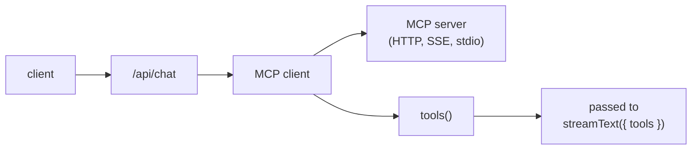

[MCP](https://modelcontextprotocol.io/) 是一种开放协议，用于向 LLM 暴露工具、资源和提示词。一个 MCP 服务器可以发布许多工具（文件系统、GitHub、Slack 或你自己的服务），任何支持 MCP 的客户端都可以使用这些工具。AI SDK 内置了 MCP 客户端；本页面介绍如何将其接入 assistant-ui 应用。

## 工作原理



MCP 客户端位于服务器端的 AI SDK 路由处理器中。它连接一个或多个 MCP 服务器，调用 `tools()` 获取工具映射，然后将该映射传递给 `streamText`。assistant-ui 现有的工具调用 UI（`ToolFallback`，或带有 `render` 的工具包条目）会渲染结果。

<Callout type="info">
  如果你使用 `"use generative"` 工具包，请在工具包中展开 `defineMcpToolkit({ ... })`，
  并在路由中使用 `AISDKToolkit`。它会为你打开 MCP 客户端，
  将其中的工具与工具包合并，并负责关闭客户端。
</Callout>

## 设置

<Steps>
<Step>

### 安装 MCP 客户端

<InstallCommand npm={["@ai-sdk/mcp"]} />

对于 stdio 传输层（仅限本地开发），还需要安装官方 MCP SDK：

<InstallCommand npm={["@modelcontextprotocol/sdk"]} />

</Step>
<Step>

### 连接到 MCP 服务器

设置服务器 URL 以及服务器要求的任何身份验证令牌：

```sh title=".env.local"
MCP_SERVER_URL=https://your-mcp-server.example/mcp
MCP_TOKEN=...
```

然后在 AI SDK 路由处理器中，使用与服务器匹配的传输层创建客户端。**HTTP** 是生产环境传输层；**SSE** 是旧版流式传输层；**stdio** 会启动本地进程，仅限开发环境使用。

```ts title="app/api/chat/route.ts"
import { createMCPClient } from "@ai-sdk/mcp";

const mcpClient = await createMCPClient({
  transport: {
    type: "http",
    url: process.env.MCP_SERVER_URL!,
    headers: { Authorization: `Bearer ${process.env.MCP_TOKEN}` },
  },
});
```

对于 stdio：


```ts
import { createMCPClient } from "@ai-sdk/mcp";
import { StdioClientTransport } from "@modelcontextprotocol/sdk/client/stdio.js";

const mcpClient = await createMCPClient({
  transport: new StdioClientTransport({
    command: "node",
    args: ["./mcp-server/dist/index.js"],
  }),
});
```

</Step>
<Step>

### 在工具包中定义 MCP 服务器

在生成式工具包中，为每个 MCP 服务器展开一个 `defineMcpToolkit({ ... })` 条目。
条目键用于命名服务器连接；MCP 服务器会发布实际的工具名称。请使用易读的键，
因为它会出现在连接、工具列表和关闭错误中，便于调试。

```tsx title="app/toolkit.tsx"
"use generative";

import { defineMcpToolkit, defineToolkit } from "@assistant-ui/react";

export default defineToolkit({
  ...defineMcpToolkit({
    github: {
      type: "http",
      url: "https://mcp.example.com/mcp",
      connectionTimeout: 10_000,
    },
  }),
});
```

当整个 MCP 服务器应保持配置状态，但不应为当前请求暴露工具时，请使用 `{ server, disabled }`，
例如缺少凭据、功能标志或套餐限制：

```tsx
defineMcpToolkit({
  docs: {
    server: {
      type: "http",
      url: process.env.DOCS_MCP_URL!,
    },
    disabled: !process.env.DOCS_MCP_URL,
  },
});
```

当服务器应保持启用状态，但需要对模型隐藏特定 MCP 工具时，请使用 `tools`：

```tsx
defineMcpToolkit({
  docs: {
    server: {
      type: "http",
      url: process.env.DOCS_MCP_URL!,
    },
    tools: {
      deleteDocument: {
        disabled: !userCanDelete,
      },
    },
  },
});
```

如果多个 MCP 服务器暴露了同名工具，请使用 `{ server, prefix }` 包裹条目，
为每个服务器的工具提供不同的模型可见名称：

```tsx
export default defineToolkit({
  ...defineMcpToolkit({
    docs: {
      server: { type: "http", url: "https://docs.example.com/mcp" },
      prefix: "docs_",
    },
    github: {
      server: { type: "http", url: "https://github.example.com/mcp" },
      prefix: "github_",
    },
  }),
});
```

如果两个服务器都发布 `search`，模型会收到 `docs_search` 和
`github_search`，而不是含义不明确的重复名称。

在路由中使用 `AISDKToolkit`。它会打开 MCP 客户端，将其中的工具与工具包的其余部分合并，
并在你调用 `close()` 时关闭客户端：

`connectionTimeout` 是可选项，单位为毫秒。将其设置为在错误的 URL 或挂起的本地进程阻塞路由之前，
使服务器端 MCP 就绪流程（`createMCPClient()` 加上 `tools()`）失败。

```ts title="app/api/chat/route.ts"
import { AISDKToolkit } from "@assistant-ui/ai-sdk";
import { openai } from "@ai-sdk/openai";
import { streamText, convertToModelMessages } from "ai";
import type { UIMessage } from "ai";
import toolkit from "../../toolkit";

export async function POST(req: Request) {
  const { messages, tools }: { messages: UIMessage[]; tools?: Record<string, any> } =
    await req.json();

  const aiToolkit = new AISDKToolkit({ toolkit });

  const result = streamText({
    model: openai("gpt-5.6-luna"),
    messages: await convertToModelMessages(messages),
    tools: await aiToolkit.tools({ frontend: tools }),
    onFinish: async () => {
      await aiToolkit.close();
    },
  });

  return result.toUIMessageStreamResponse();
}
```

</Step>
<Step>

### 将工具接入路由

如果要手动控制 MCP 客户端，`mcpClient.tools()` 会返回一个对象，其结构
与 `streamText` 的 `tools` 参数完全相同。将其与自定义工具一并展开，
并在响应完成时关闭客户端：

```ts title="app/api/chat/route.ts"
import { createMCPClient } from "@ai-sdk/mcp";
import { openai } from "@ai-sdk/openai";
import { streamText, convertToModelMessages } from "ai";
import type { UIMessage } from "ai";

export const maxDuration = 60;

export async function POST(req: Request) {
  const { messages }: { messages: UIMessage[] } = await req.json();

  const mcpClient = await createMCPClient({
    transport: {
      type: "http",
      url: process.env.MCP_SERVER_URL!,
      headers: { Authorization: `Bearer ${process.env.MCP_TOKEN}` },
    },
  });

  const tools = await mcpClient.tools();

  const result = streamText({
    model: openai("gpt-5.6-luna"),
    messages: await convertToModelMessages(messages),
    tools,
    onFinish: async () => {
      await mcpClient.close();
    },
  });

  return result.toUIMessageStreamResponse();
}
```

`onFinish` 是调用 `close()` 的合适位置：它会在流式传输完成后触发，
因此只要模型仍在调用工具，连接就会保持打开。

</Step>
<Step>

### 组合多个 MCP 服务器

每个服务器都有自己的客户端。将它们的工具映射合并展开：

```ts
const githubClient = await createMCPClient({
  transport: { type: "http", url: process.env.GITHUB_MCP_URL! },
});
const filesClient = await createMCPClient({
  transport: { type: "http", url: process.env.FILES_MCP_URL! },
});

const tools = {
  ...(await githubClient.tools()),
  ...(await filesClient.tools()),
};

// remember to close both in onFinish
```

如果两个服务器暴露了同名工具，后展开的工具会覆盖先展开的工具。请根据需要重命名或限定作用域。

</Step>
<Step>

### 在 UI 中渲染结果

工具调用会通过现有的 assistant-ui 工具调用渲染流程。无需额外设置时，内置的
`<ToolFallback>` 组件会渲染调用名称、参数和结果。要为生成式工具包中的特定工具自定义外观，
请添加 `externalTool()` 渲染器，其键与 MCP 工具名称匹配：

<PlatformTabs>
<Tab value="React">

```tsx title="app/toolkit.tsx"
"use generative";

import { defineMcpToolkit, defineToolkit, externalTool } from "@assistant-ui/react";

type Args = { repo: string; number: number };
type Result = { title: string; state: string; url: string };

export default defineToolkit({
  ...defineMcpToolkit({
    github: { type: "http", url: "https://mcp.example.com/mcp" },
  }),
  github_get_issue: {
    execute: externalTool(),
    render: ({ args, result }: { args: Args; result?: Result }) => (
      <div className="rounded border p-3">
        <div className="font-mono text-sm">{args.repo}#{args.number}</div>
        {result && (
          <a href={result.url} className="underline">
            {result.title} ({result.state})
          </a>
        )}
      </div>
    ),
  },
});
```

</Tab>
<Tab value="React Native">

```tsx title="components/GitHubIssueToolUI.tsx"
import { defineToolkit } from "@assistant-ui/react-native";
import { Linking, Pressable, Text, View } from "react-native";

type Args = { repo: string; number: number };
type Result = { title: string; state: string; url: string };

export const toolkit = defineToolkit({
  github_get_issue: {
    type: "backend",
    render: ({ args, result }: { args: Args; result?: Result }) => (
      <View style={{ borderWidth: 1, borderRadius: 6, padding: 12 }}>
        <Text style={{ fontFamily: "Menlo", fontSize: 13 }}>
          {args.repo}#{args.number}
        </Text>
        {result && (
          <Pressable onPress={() => Linking.openURL(result.url)}>
            <Text style={{ textDecorationLine: "underline" }}>
              {result.title} ({result.state})
            </Text>
          </Pressable>
        )}
      </View>
    ),
  },
});
```

</Tab>
<Tab value="React Ink">

```tsx title="components/GitHubIssueToolUI.tsx"
import { defineToolkit } from "@assistant-ui/react-ink";
import { Box, Text } from "ink";

type Args = { repo: string; number: number };
type Result = { title: string; state: string; url: string };

export const toolkit = defineToolkit({
  github_get_issue: {
    type: "backend",
    render: ({ args, result }: { args: Args; result?: Result }) => (
      <Box borderStyle="round" paddingX={1} flexDirection="column">
        <Text>
          {args.repo}#{args.number}
        </Text>
        {result && (
          <Text>
            {result.title} ({result.state}) — {result.url}
          </Text>
        )}
      </Box>
    ),
  },
});
```

</Tab>
</PlatformTabs>

使用 `Tools({ toolkit })` 注册一次工具包。诸如 `github_get_issue` 的渲染器键
必须与 MCP 服务器发布的工具名称匹配。

```tsx title="app/components/RuntimeProvider.tsx"
"use client";

import { AssistantRuntimeProvider, AuiConfig, Tools } from "@assistant-ui/react";
import { useChatRuntime } from "@assistant-ui/ai-sdk";
import type { ReactNode } from "react";

import { toolkit } from "./GitHubIssueToolUI";

export function MyRuntimeProvider({ children }: { children: ReactNode }) {
  const runtime = useChatRuntime();
  const config = AuiConfig({ tools: Tools({ toolkit }) });
  return (
    <AssistantRuntimeProvider
      runtime={runtime}
      config={config}
    >
      {children}
    </AssistantRuntimeProvider>
  );
}
```

`useChatRuntime()` 默认指向 `/api/chat`。如需指向其他端点或自定义请求，请参阅[自定义传输层](/docs/runtimes/ai-sdk/v7#custom-transport)。

</Step>
<Step>

### MCP 工具运行前要求批准

MCP 工具在服务器端执行，因此批准是服务器端工具门控，而不是 `humanTool()` 结果。
使用 AI SDK v7 的调用级 `toolApproval` 选项对调用进行门控，并以工具的模型可见名称作为键。
工具名称保持不变，因此你的自定义渲染器或默认的 `ToolFallback` 会像接收其他后端工具一样，
接收 `approval` 和 `respondToApproval`：

```ts title="app/api/chat/route.ts"
const tools = await mcpClient.tools();

const result = streamText({
  model: openai("gpt-5.6-luna"),
  messages: await convertToModelMessages(messages),
  tools,
  toolApproval: {
    github_delete_repository: "user-approval",
  },
  onFinish: async () => {
    await mcpClient.close();
  },
});
```

使用 `AISDKToolkit` 时，将相同的 `toolApproval` 选项与 `await aiToolkit.tools(...)` 返回的工具一并传入；
如果条目设置了前缀名称，请使用带前缀的名称作为键。

在客户端，让 AI SDK 将记录的批准决定发送回路由：

```tsx title="app/components/RuntimeProvider.tsx"
import { lastAssistantMessageIsCompleteWithApprovalResponses } from "ai";

const runtime = useChatRuntime({
  sendAutomaticallyWhen: lastAssistantMessageIsCompleteWithApprovalResponses,
});
```

对于删除、写入、部署或调用特权 MCP 工具等由后端负责的操作，请使用此模式。
仅当用户自行提供工具结果时，才使用 `humanTool()`。如需自定义批准 UI，请参阅[服务器端批准门控](/docs/tools/tool-ui#server-side-approval-gates)；
如需完整的接线设置，请参阅[服务器端工具批准](/docs/runtimes/ai-sdk/v7#server-side-tool-approval)。

</Step>
<Step>

### 运行和验证

启动应用并触发工具调用（例如，让助手执行 MCP 服务器能够完成的操作）。确认：

- 工具调用会以预期参数显示在聊天中。
- 结果能够渲染（通过自定义的 `ToolUI` 或回退方案）。
- 没有连接泄漏：MCP 客户端会在每次响应后关闭。如果看到打开的连接不断累积，请检查 `onFinish`。

</Step>
</Steps>

## 注意事项

- **仅限服务器端。** MCP 客户端使用 Node API（套接字，也可以使用子进程）。切勿在客户端代码中实例化它。
- **每个请求一个生命周期。** 每个请求创建一个全新的客户端可以简化连接状态。对于高吞吐量服务器，请谨慎自行复用客户端：AI SDK 的 `tools()` 调用假设在执行 `streamText` 时连接仍然存活。
- **采样。** 如果你的 MCP 服务器使用 `sampling/createMessage`（允许服务器在调用过程中请求 LLM），assistant-cloud 用户可以通过 [`instrumentMcpSampling`](/docs/cloud) 对其进行监测，以实现可观测性。这与上述接线方式无关。
- **传输层选择。** 对于任何联网服务器，使用 HTTP。仅当服务器不支持 HTTP 时使用 SSE。stdio 用于在 monorepo 中针对 MCP 服务器进行本地开发。

## 相关内容

<Cards>
  <Card
    title="AI SDK 运行时"
    description="将 MCP 工具调用传递到聊天 UI 的运行时。"
    href="/docs/runtimes/ai-sdk/v7"
  />
  <Card
    title="工具与工具 UI"
    description="为工具调用和批准构建自定义渲染器。"
    href="/docs/tools/defining-tools"
  />
</Cards>
