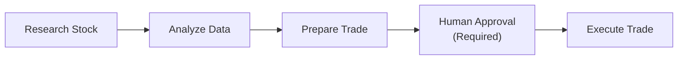

## 概述

一个使用 LangGraph 构建的股票交易助手，用于演示人在回路（human in the loop）工作流。该助手可以研究股票、分析市场数据并准备交易，但在执行任何交易前都需要用户明确批准。对于 AI 协助处理高风险决策的应用，此模式至关重要。

## 功能

- **多步骤工作流**：将复杂操作拆分为 LangGraph 节点
- **人在回路**：关键操作需要用户确认
- **状态持久化**：在多次交互之间维护工作流状态
- **工具集成**：连接股票市场 API
- **审批 UI**：提供清晰的界面，用于审核和批准操作
- **审计跟踪**：完整记录 AI 决策和用户审批历史

## 工作原理



1. 用户询问某只股票（例如：“我应该买入 AAPL 吗？”）
2. AI 研究该股票并分析市场数据
3. AI 准备交易建议
4. **工作流暂停**，等待用户批准
5. 用户审核并批准或拒绝交易
6. 如果获得批准，则执行交易

## 集成

使用 `@assistant-ui/react-langgraph` 集成 LangGraph：

```tsx
import { useLangGraphRuntime } from "@assistant-ui/react-langgraph";
import { AssistantRuntimeProvider } from "@assistant-ui/react";
import { Thread } from "@/components/assistant-ui/elements/thread.aui";
import { Client } from "@langchain/langgraph-sdk";

const langGraphClient = new Client({
  apiUrl: process.env.LANGGRAPH_API_URL,
});

export default function StockbrokerChat() {
  const runtime = useLangGraphRuntime({
    stream: async (messages, { abortSignal, initialize }) => {
      const { remoteId } = await initialize();
      return langGraphClient.runs.stream(
        remoteId,
        "stockbroker-assistant",
        {
          input: { messages },
          streamMode: "messages",
        },
        { signal: abortSignal }
      );
    },
    create: async () => {
      const { thread_id } = await langGraphClient.threads.create();
      return { externalId: thread_id };
    },
  });

  return (
    <AssistantRuntimeProvider runtime={runtime}>
      <Thread />
    </AssistantRuntimeProvider>
  );
}
```

### 人在回路模式

在 LangGraph 工作流中定义一个中断点：

```python
from langgraph.graph import StateGraph
from langgraph.checkpoint.memory import MemorySaver

def prepare_trade(state):
    # Prepare trade details
    return {"trade": trade_details, "needs_approval": True}

def execute_trade(state):
    # Execute the approved trade
    return {"result": "Trade executed"}

# Graph with interrupt
graph = StateGraph(State)
graph.add_node("prepare", prepare_trade)
graph.add_node("execute", execute_trade)

# Interrupt before execute for human approval
graph.add_edge("prepare", "execute")
app = graph.compile(interrupt_before=["execute"], checkpointer=MemorySaver())
```

### 审批 UI 组件

```tsx
const toolkit = defineToolkit({
  execute_trade: {
    type: "backend",
    render: ({ args, status, addResult }) => {
    if (status.type === "requires-action") {
      return (
        <div className="rounded-lg border p-4">
          <h3>Trade Approval Required</h3>
          <p>Buy {args.shares} shares of {args.symbol}</p>
          <div className="flex gap-2">
            <Button onClick={() => addResult({ approved: true })}>
              Approve
            </Button>
            <Button onClick={() => addResult({ approved: false })}>
              Reject
            </Button>
          </div>
        </div>
      );
    }
    return <p>Trade {status}...</p>;
  },
  },
});
```

## 源代码

<SourceLink href="https://github.com/assistant-ui/assistant-ui-stockbroker" />
